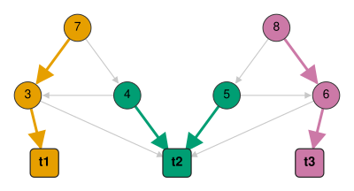
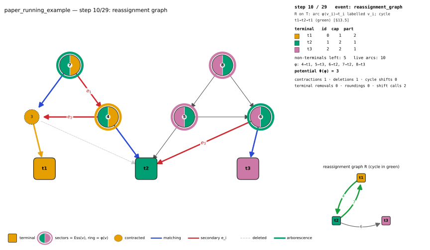

# glsolver

**Exact, polynomial-time Győri–Lovász graph partitioning — with a certificate and an independent verifier for every answer.**

[](https://github.com/mahi97/glsolver/actions/workflows/ci.yml)
[](LICENSE)
[](pyproject.toml)
[](CMakeLists.txt)

Give `glsolver` a graph that stays connected after deleting any `k − 1` vertices, pick `k` special
vertices (*terminals*) and pick how big you want each part to be. It returns a split of the vertices
into `k` groups of **exactly** those sizes, each group connected and each containing its terminal —
plus a spanning tree per group that proves the connectivity. That such a split always exists is the
Győri–Lovász theorem (1976/1977); *finding* one in polynomial time for general `k` was open for
about fifty years, and was widely suspected to be hard. It was settled in 2026 by Hajiaghayi,
JafariRaviz, Kaviani and Mohammadkhani ([arXiv:2608.30945](https://arxiv.org/abs/2608.30945)). This
repository is an independent, from-scratch implementation of that algorithm.

<p align="center">
  
</p>
<p align="center"><sub>The paper's running example solved: three connected parts, each with its terminal and its certifying in-arborescence.</sub></p>

## Quickstart

```bash
pip install -e ".[dev]"          # from a clone; see Installation for the C++ core and Docker
```

```python
import networkx as nx
from glsolver import partition

G = nx.circulant_graph(12, [1, 2])                            # 4-connected
res = partition(G, terminals=[0, 3, 6, 9], sizes=[3, 3, 3, 3])

res.summary()    # 'general: status=ok n=12 m=32 k=4 runtime=0.0067s verifier=VALID'
res.parts        # [[0, 1, 2], [3, 4, 5], [6, 7, 8], [9, 10, 11]]
res.valid        # True  — verdict of the independent verifier
res.certificate["parents"]   # {1: 0, 2: 0, 4: 3, 5: 3, 7: 6, 8: 6, 10: 9, 11: 9}
```

The same run from the shell — generate, solve, and re-check with a verifier that shares no code with any solver:

```console
$ glsolve generate harary --n 12 --k 3 --seed 1 -o h12.json
wrote h12.json: n=12 m=27 k=3 directed=False weighted=False

$ glsolve solve h12.json -o sol12.json
general: status=ok n=12 m=27 k=3 runtime=0.0023s verifier=VALID
part 0 (terminal 1, size 4): 0 1 6 7
part 1 (terminal 2, size 4): 2 3 4 5
part 2 (terminal 9, size 4): 8 9 10 11
solution written to sol12.json

$ glsolve verify h12.json sol12.json
VALID
```

`glsolve solve` exits `0` on a verified partition, `2` on a non-`ok` status and `3` if the verifier
rejects the output. It also reads plain edge lists
(`glsolve solve g.edgelist --terminals 0,2 --sizes 2,2 [--directed]`; formats in
[docs/instance_format.md](docs/instance_format.md)), records a replayable trace with `--trace` and
prints counters with `--stats`. `glsolve inspect FILE --preconditions` reports degrees, acyclicity,
`k`-`T`-connectivity, FEAC and the algorithm `auto` would pick.

## What it solves

| formulation | input | output | precondition |
|---|---|---|---|
| classical undirected | undirected `G`, terminals `t_i`, sizes `n_i` with `Σ n_i = n` | `V_i ∋ t_i`, `\|V_i\| = n_i`, `G[V_i]` connected | `G` is `k`-vertex-connected |
| Lovász directed | digraph `G`, terminals, capacities `c_i ≥ 0`, `Σ c_i = \|V\T\|` | `\|V_i\| = c_i + 1`, spanning in-arborescence rooted at `t_i` | `k`-`T`-connected, or the weaker FEAC |
| weighted / confluent | plus integer weights `w_v ≥ 1`, `Σ w_v ≤ Σ c_t` | `Σ_{v ∈ V_t\T} w_v ≤ c_t + w_max − 1` (tight) | `k`-`T`-connected, or the weaker FESAC |
| DAG | acyclic `G`, optional weights | as above; exact for unit weights with `Σ c = \|V\T\|` | acyclic, every non-terminal has out-degree `≥ k` |

Undirected input is reduced to the directed formulation (each edge becomes two arcs, arcs leaving
terminals are dropped, `c_i = n_i − 1`). Nothing here is an approximation: unweighted sizes are hit
exactly, and the weighted slack `w_max − 1` is provably unavoidable.

**`precondition_failed` never means "no partition exists".** The theorem's hypothesis is
*sufficient*, not necessary. When it fails the solvers stop and name the offending vertex or
Hall-deficient set; only the exact oracles (`bruteforce`, `ilp`) can prove non-existence. In the
exhaustive digraph enumeration, 48 of the 1 518 non-FEAC instances still admit a partition
([docs/verification.md](docs/verification.md) §9).

## Installation

Python ≥ 3.10, NumPy and NetworkX are the only hard requirements. The repository's checked-in
virtualenv is a **uv-managed CPython 3.12** (uv 0.12.3), so the usual entry point is:

```bash
cd /path/to/gs && source .venv/bin/activate   # or: uv venv && source .venv/bin/activate
pip install -e ".[dev]"
```

Building the C++20 core needs CMake ≥ 3.20, Ninja and `g++ ≥ 10` or clang (`scikit-build-core` and
`pybind11` come from the build backend). **Without a compiler the install still succeeds** and every
algorithm runs in pure Python; `glsolver.core_available()` reports which backends are compiled.
Extras: `ilp` (SciPy/HiGHS oracle), `viz` (matplotlib, pillow, imageio), `bench`, `test`, `dev`.

```bash
GLCORE_DEBUG_ASSERTS=ON pip install -e ".[dev]"   # compile invariants A1–A8 into the core
GLCORE_SANITIZE=ON      pip install -e ".[dev]"   # ASan/UBSan (see docs/implementation.md)
GLSOLVER_NO_CORE=1 pytest ...                     # ignore an installed core at runtime

docker build -t glsolver .                        # CPU-only image: builds the core, installs [dev]
docker run --rm glsolver solve --help
docker run --rm -v "$PWD:/data" glsolver solve /data/instance.json --stats
```

## Features

* **Three exact algorithms** — general (undirected and directed), weighted, near-linear DAG — each
  in two independent implementations, dispatched by `algorithm="auto"`.
* **Reference and core.** [`reference/glref/`](reference/glref) is a literal, line-by-line
  transcription of the paper: deliberately slow, and the ground truth for everything else.
  [`src/glcore/`](src/glcore) is an optimized C++20 core (pybind11 → `glsolver._core`) with a
  vertex-split CSR flow network, a per-vertex max-flow certificate oracle, a criticality oracle,
  Hopcroft–Karp matching and a min-cost flow.
* **A certificate with every answer**: a spanning in-arborescence per part, over the *original* arcs.
* **An independent verifier** (`glsolver.verify`): standard-library BFS on the original input,
  importing no solver, oracle or reference module.
* **Exact oracles** for small instances — backtracking brute force and a single-commodity-flow MILP
  (HiGHS), the only components that can answer `"infeasible"`.
* **Step-by-step visualization** of a real run (SVG/PNG/PDF/HTML/GIF/MP4), driven by the trace.
* **Tooling**: `glsolve` CLI, NetworkX interop, 21 seeded instance families
  (`glsolver.generators.family_catalog()`), a benchmark runner with subprocess isolation and a
  verification dashboard.

## Performance

Median wall time in seconds, `k = 4`, balanced capacities, 20-core aarch64, C++ core at
`threads = 8` (the DAG solver is single-threaded); 3 seeds × 3 trials to `n = 2000`, single runs
above; every partition verifier-accepted. Source: [docs/benchmarks.md](docs/benchmarks.md) §5.2.

| family | `n = 1000` | `n = 2000` | `n = 5000` | `n = 10000` | fitted growth |
|---|---:|---:|---:|---:|---:|
| random 4-regular | 0.19 | 0.47 | 2.25 | 12.4 | `n^1.75` |
| sparse `k`-connected | 0.18 | 0.40 | 2.08 | 12.1 | `n^1.77` |
| Harary `H_{4,n}` (exactly `k`-connected) | 0.53 | 3.44 | 30.5 | 418 | `n^2.76` |
| Erdős–Rényi, `m ≈ n²/10` (`m = 10^7` at `n = 10^4`) | 0.13 | 1.14 | 28.1 | 210 | `n^3.09` ≈ `m^1.5` |
| DAG solver on `k`-`T`-connected DAGs | 0.00033 | 0.00068 | 0.0016 | 0.0026 | `n^0.88` |

The DAG solver handles `n = 10^6`, `m ≈ 5·10^6` in **0.238–0.696 s** single-threaded across all six
variant/policy combinations, with fitted exponents 1.00–1.13 (§5.6). The paper's 17-copy
counterexample (`n = 3 789`, `m = 33 264`, `k = 9`) is solved in **0.47 s** (§5.3); the pure-Python
reference needs **900 s** on its 1-copy version ([docs/verification.md](docs/verification.md) §9).

Against that reference on identical instances at `n = 100` — the largest size it reaches in
reasonable time — the core is **1 529× to 28 295×** faster (§5.8). Peak memory (`VmHWM`) at
`n = 10 000`: 102 MB random-regular, 144 MB sparse `k`-connected, 2.79 GB Harary, and 2.86 GB on the
10-million-arc Erdős–Rényi instance, of which 2.57 GB is the instance itself and only ≈ 290 MB the
solver ([RESEARCH_NOTES.md](RESEARCH_NOTES.md) §E6). The ten optimizations behind these numbers,
each with a correctness argument — and the shortcuts that are *not* valid — are in
[docs/optimizations.md](docs/optimizations.md).

## Correctness evidence

| evidence | scale | result | source |
|---|---|---|---|
| Test suite | 2 584 passed, 21 skipped, 0 failed in 88 s (33 files; `pytest -m "not slow" -n auto --hypothesis-profile=ci`) | green | [tests/](tests) |
| Exhaustive undirected: every connected graph on `n ≤ 7`, every terminal subset, every capacity composition | 145 400 instances × reference + C++ general + weighted, debug assertions on | 0 failures | [docs/verification.md](docs/verification.md) §10.1 |
| Exhaustive directed: every digraph on `n ≤ 4`, `k ∈ {1,2}` | 3 278 instances | 0 failures | §10.1 |
| Differential fuzzing, C++ primitives vs. reference | ≈ 4 400 seeded instances | identical `κ`, tightest cuts, `Ess`, criticality | §10.3 |
| Differential fuzzing, solvers, every option combination | ≈ 6 000 instances, incl. trace replay against exact essential sets | verifier-accepted, statuses agree | §10.3 |
| Benchmark sweep | 1 151 rows | 0 INVALID, 0 solver/oracle disagreements | [docs/benchmarks.md](docs/benchmarks.md) §5.1 |
| Sanitizers | core built with `GLCORE_SANITIZE=ON` **and** `GLCORE_DEBUG_ASSERTS=ON` | ASan/UBSan clean, in CI | §10.4 |
| CI | 3 jobs per push/PR: suite on Python 3.10 & 3.12 + ruff, sanitizer job, Docker build | green | [.github/workflows/ci.yml](.github/workflows/ci.yml) |

Two mechanisms make this more than a tally. The **independent verifier** re-derives everything from
the original input: exact cover, terminal membership, exact sizes (or the weighted bound), and — for
undirected input — *both* reachability to `t_i` inside the part and undirected connectivity in the
original edge set, which must agree. The **debug assertions A1–A8** check the paper's invariants
after every operation; the mutation matrix in [tests/test_harness_review.py](tests/test_harness_review.py)
exhibits injected bugs (a stale `Ess` after terminal removal, contraction of an out-degree-2
pre-terminal) that still produce a *valid partition on every enumerated instance* and are caught
only by a violated invariant.

## Visualization

`glsolver.viz` replays the trace events a solver emits. The viewer imports no solver internals, so a
C++ run is drawn exactly as the C++ solver saw it. Each frame draws every non-terminal as a circle
whose sectors are its essential terminals `Ess(v)` and whose ring is its assigned terminal `φ(v)`,
contracted vertices in their part's colour, deleted arcs greyed out, and — inside a
`ShiftAssignment` call — the matching, the secondary arcs `e_i`, the criticality table and the
reassignment graph with the chosen cycle in green and the potential `Φ` before → after each shift.

<p align="center">
  
</p>
<p align="center"><sub><code>glsolve visualize examples/curated/paper_running_example.json --format svg --step 10 -o step10.svg</code></sub></p>

```bash
glsolve visualize INSTANCE.json --format html -o run.html   # svg | png | pdf | html | gif | mp4
python examples/render_all.py                               # all curated examples → examples/output/
```

Seven curated instances in [examples/curated/](examples/curated) exercise every operation in
readable frames — the paper's running example (2 cycle shifts) and essential-set example, its
contraction counterexample (every contraction breaks `k`-`T`-connectivity, so 6 deletions must come
first), a Harary instance with 3 cycle shifts, the gadget where removing a zero-capacity terminal
creates a *new* essential terminal, a `RoundAndRemove` weighted instance and a small DAG.
Conventions and the state-replay contract: [visualization/README.md](visualization/README.md).

## Limitations

* **Polynomial is not small.** `≤ n + m` rounds, each with up to `k|V\T|` cycle shifts over a
  criticality table costing `k·|V\T|` max-flows. The optimizations cut constants and usually the
  flow count, but prove no better bound (open conjecture C2).
* **Memory before time on large sparse inputs.** The essential oracle stores a max-flow certificate
  and, when its cut is exact, the `L`/`S`/`R` side of *every* vertex — `Θ(n²)` bytes for the sides
  alone. The DAG solver has no such structure.
* **Trace mode is for small instances**; every event carries the full state needed for replay.
* **The oracles do not scale**: brute force and the MILP are exponential in practice, and the
  harness gives them 60 s and treats a timeout as inconclusive.
* **No GPU path.** The one embarrassingly parallel phase is OpenMP over CPU cores; a batched GPU
  kernel is conjecture C3 and has not been prototyped.

## Repository map

```
src/glsolver/      API, CLI, instance I/O, independent verifier, preconditions, generators,
                   oracles (bruteforce, ILP), testing helpers, visualization (viz/)
src/glcore/        C++20 core → glsolver._core: graph, flow, essential/criticality oracles,
                   matching, min-cost flow, the three solvers
reference/glref/   pure-Python reference implementation of the paper (ground truth)
tests/             pytest suites: exhaustive, property-based, per-module adversarial reviews
benchmarks/        runner, configs, plotting, report/dashboard, machine provenance
examples/          curated instances (curated/) and render_all.py
visualization/     drawing conventions and API reference for glsolver.viz
scripts/           run_exhaustive.py, run_benchmarks.sh
regression/        permanently stored regression instances (JSON)
```

| document | contents |
|---|---|
| [docs/paper_notes.md](docs/paper_notes.md) | master specification: paper → implementation map, §13 underspecified points, §14 trace model |
| [docs/theorem.md](docs/theorem.md) | the Győri–Lovász theorem and its history, in plain language |
| [docs/algorithm.md](docs/algorithm.md) | the three operations, cycle shifts, the running example, certificates |
| [docs/flow_essential_assignment.md](docs/flow_essential_assignment.md) | essential terminals, the cut lattice, FEAC/FESAC, proof of the transfer lemma |
| [docs/weighted_algorithm.md](docs/weighted_algorithm.md) | min-cost split assignment, `RoundAndRemove`, the `w_max − 1` slack |
| [docs/dag_algorithm.md](docs/dag_algorithm.md) | the out-degree characterization, the `O(n+m)` stack variant, policies |
| [docs/optimizations.md](docs/optimizations.md) | O1–O10 with correctness arguments, and the shortcuts that are *not* valid |
| [docs/implementation.md](docs/implementation.md) | layers, dispatcher, determinism, debug and sanitizer builds |
| [docs/verification.md](docs/verification.md) | verifier, oracles, exhaustive and property tests, regression store, results |
| [docs/benchmarks.md](docs/benchmarks.md) | what is measured, methodology, configurations, reproduction, result tables |
| [docs/api.md](docs/api.md) | `glpartition`/`partition` contract, `GLResult` fields, precondition semantics |
| [docs/instance_format.md](docs/instance_format.md) | canonical instance/solution JSON and the edge-list format |

[FINAL_REPORT.md](FINAL_REPORT.md) is the project write-up; [CHANGELOG.md](CHANGELOG.md) tracks
releases.

## Reproducing everything

```bash
cd /path/to/gs && source .venv/bin/activate

pytest -q -m "not slow" -n auto --hypothesis-profile=ci   # 2 584 passed, 21 skipped, ~88 s
pytest -q -m "not slow" -n auto                           # default dev profile; HYPOTHESIS_PROFILE=thorough for 2000 examples
pytest -q tests/test_edge_cases.py --runslow -k counterexample   # slow: the counterexample in pure Python (900 s)

python scripts/run_exhaustive.py --max-n 7 --jobs 16      # 145 400 undirected + 3 278 directed, ~3 min
python scripts/run_exhaustive.py --max-n 6 --solver reference --oracles --jobs 8

python -m benchmarks.runner smoke                         # must exit 0 before anything expensive
scripts/run_benchmarks.sh                                 # all configs, then plots + dashboard
python -m benchmarks.machine --info                       # hardware/software provenance

docker build -t glsolver . && docker run --rm glsolver solve --help
ruff check src reference tests benchmarks scripts
```

Everything is seeded. Instances derive from `(family, n, k, capacity mode, seed, variant)` and are
cached with the file's SHA-256 plus a fingerprint of the generator sources, so a stale cache cannot
feed old instances to a new run; heuristic choices take a `seed=`; parallel loops reduce into
per-index slots; benchmark runs set `PYTHONHASHSEED=0`, record the thread environment per row and
isolate each *(instance, algorithm)* pair in its own subprocess. Environment variables:
`GL_SOLVER_TIME_LIMIT` (default 20 s), `GL_EXHAUSTIVE_FULL`, `GL_EXHAUSTIVE_TALLY`,
`HYPOTHESIS_PROFILE`, `GLSOLVER_NO_CORE`.

## Research results

Work done here rather than taken from the paper; proofs and measurements in [RESEARCH_NOTES.md](RESEARCH_NOTES.md):

* **Proved.** P1 — the DAG algorithm runs in `O(n + m)` with a stack instead of heaps (implemented;
  20–33 % faster on layered DAGs). P2 — certified-subset essential sets suffice, which is what makes
  the incremental oracle sound. P3 — a Nagamochi–Ibaraki sparse certificate is sound for the initial
  flows on dense undirected input. P4 — penalized routing leaves `κ`, the tightest cut and `Ess` fixed.
* **Refuted.** C1, our own conjecture that fan-routed certificates would make most deletions free:
  implemented exactly as stated and measured against plain BFS, it changes the repairs-per-deletion
  on Harary `H_{4,1000}` by −0.1 % and is 17 % slower; the flaw is that the fan controls only how
  paths *arrive* at the pre-terminals, not the transits that dominate the run (§E5).
* **Open.** C2 — an amortized bound below `O(n k m²)`. C3 — a batched GPU kernel for the per-vertex
  certificate phase, not prototyped.

## Citation

Cite the paper; add the software entry only if the implementation itself matters for your results.

```bibtex
@misc{hajiaghayi2026gyorilovasz,
  title  = {Breaking the Exponential Barrier: The First Polynomial-Time Algorithm for the
            {G}y{\H{o}}ri--{L}ov{\'a}sz Theorem},
  author = {Hajiaghayi, Mohammad T. and JafariRaviz, Mahdi and Kaviani, Alireza
            and Mohammadkhani, Soheil},
  year   = {2026}, eprint = {2608.30945}, archivePrefix = {arXiv}, primaryClass = {cs.DS},
  url    = {https://arxiv.org/abs/2608.30945}
}

@software{glsolver2026,
  title  = {glsolver: an independent implementation of the polynomial-time
            {G}y{\H{o}}ri--{L}ov{\'a}sz algorithm},
  author = {{glsolver contributors}}, year = {2026}, version = {0.1.0},
  note   = {Independent implementation of arXiv:2608.30945; not affiliated with its authors}
}
```

## Relationship to the paper, and independence

[docs/paper_notes.md](docs/paper_notes.md) is the single source of truth for this repository: every
non-trivial function in `reference/` and `src/` cites a label from it (`[Def X]`, `[Lem Y]`,
`[Alg Z]`), and its §12 is a lemma → function map kept in sync with the code. Its §13 records every
point where the paper is underspecified, with the derivation used here and the tests validating it.
The appendix's relaxed conditions (local and compact connectivity) are implemented as *recognizers*
only; Győri's exponential cascade argument is not implemented as a solver.

**This is an independent implementation.** It is not affiliated with, endorsed by or reviewed by the
authors of arXiv:2608.30945, and it is not their reference implementation. Their supplementary
repository (`mahdi-jfri/Gyori-Lovasz-Codes`, MIT) contains **only** the appendix's
compact-connectivity counterexample, not the algorithm; that counterexample is reproduced
independently here ([reference/glref/counterexample.py](reference/glref/counterexample.py)) as a
regression test, and its claims — compact connectivity holds, every arc deletion and every
pre-terminal contraction breaks it — are re-checked rather than assumed. Everything in `docs/` is
our reading of the paper, not the paper itself; any errors in the interpretation, the code, the
proofs in `RESEARCH_NOTES.md` or the measurements are ours, not the authors'.

## Contributing

Issues and pull requests are welcome. Before opening one:

1. `ruff check src reference tests benchmarks scripts` and
   `pytest -q -m "not slow" -n auto --hypothesis-profile=ci` must pass.
2. Anything touching an algorithm cites its `docs/paper_notes.md` label in the docstring or header
   comment, and keeps the lemma → function map of §12 in sync.
3. A new optimization needs a correctness argument in [docs/optimizations.md](docs/optimizations.md)
   — including why the obvious cheaper version is unsound, if it is.
4. A fixed bug becomes a named regression instance under [regression/](regression) (via
   `glsolver.testing.regression.save_failure`); a performance claim becomes a benchmark row.

## License

MIT — see [LICENSE](LICENSE).
