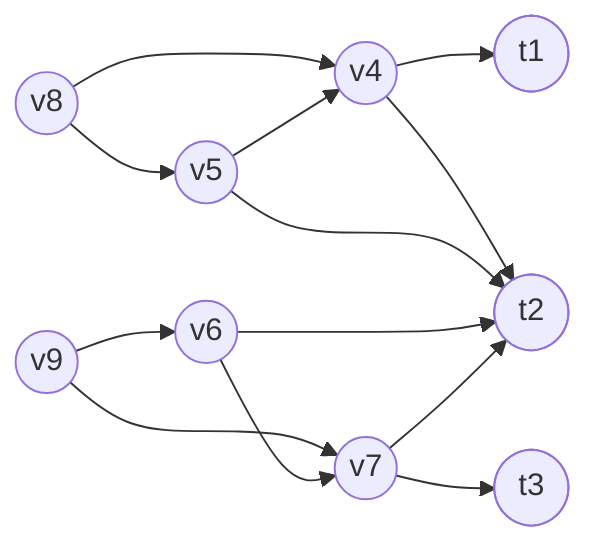
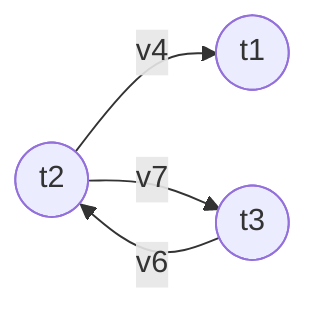
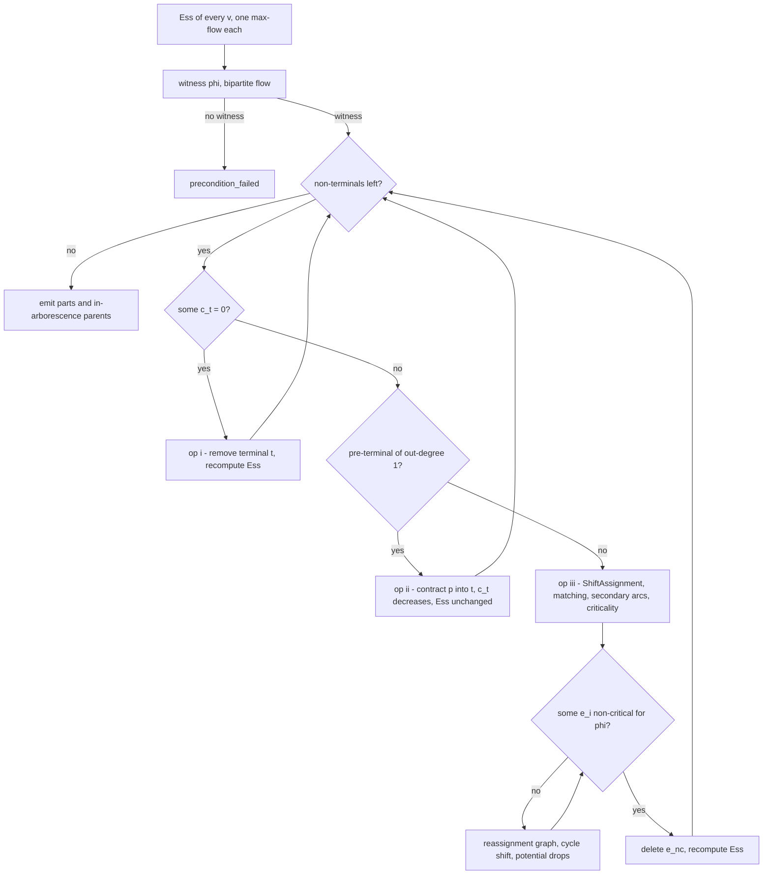

# The general polynomial-time algorithm

**GLPartition** [Alg 1] and its subroutine **ShiftAssignment** [Alg 2]: the
unweighted polynomial-time algorithm of arXiv:2608.30945 for Lovász's directed
Győri–Lovász theorem. Labels in square brackets are those of
`docs/paper_notes.md`, the master specification of the paper; every claim below
is traceable to one. Companions: `docs/flow_essential_assignment.md` (the
condition), `docs/weighted_algorithm.md` [Alg 3/4], `docs/dag_algorithm.md`
[Alg 5], `docs/optimizations.md`, `docs/theorem.md`.

---

## (a) Setting and notation

A **directed** simple graph $G=(V,E)$ (no self-loops, no parallel arcs), a set
of distinct **terminals** $T=\{t_1,\dots,t_k\}\subseteq V$, and **capacities**
$c_1,\dots,c_k\in\mathbb{Z}_{\ge0}$ with $\sum_i c_i=|V\setminus T|$.
**Terminals have no outgoing arcs**: arcs leaving a terminal are dropped at
load time, WLOG (paper §2), since $t_i$ is the sink of every path inside its
part.

> **[Def connected-to]** $G[V']$ is *connected to* $v\in V'$ if every $u\in V'$
> has a directed path to $v$ inside $G[V']$; equivalently $G[V']$ contains a
> spanning **in-arborescence** rooted at $v$.

**Goal.** Partition $V$ into $V_1,\dots,V_k$ with $t_i\in V_i$,
$|V_i|=c_i+1$, and $G[V_i]$ connected to $t_i$. Notation: $n=|V|$, $m=|E|$,
$k=|T|$; $N^+(v)$, $d^+(v)$ = out-neighbourhood and out-degree; $V\setminus T$
= *non-terminals*.

> **[Def 2.1 pre-terminal, contraction]** A non-terminal $p$ is a
> *pre-terminal* if $(p,t)\in E$ for some terminal $t$; $PT(G,S)$ = pre-terminals
> with an arc into $S\subseteq T$. *Contracting $p$ into $t$* (requires
> $(p,t)\in E$) deletes $p$, redirects every in-arc $(u,p)$ to $(u,t)$ — merging
> duplicates — and deletes $p$'s out-arcs. No self-loop appears, since
> in-neighbours of $p$ are never terminals.

The classical undirected theorem is the case where each edge $\{u,v\}$ becomes
$(u,v),(v,u)$, arcs out of terminals are dropped, and $c_i=n_i-1$
(`paper_notes` §1.1).

---

## (b) Terminal connectivity, cuts and the tightest minimum cut

> **[Def 3.2 terminal connectivity]** For a non-terminal $v$, $\kappa_G(v)$ is
> the maximum size of a family of paths starting at $v$, ending at **distinct**
> terminals, pairwise vertex-disjoint except for the common start $v$.
> $G$ is **$k$-$T$-connected** if $\kappa_G(v)=k$ for every non-terminal $v$.

Always $\kappa_G(v)\le\min(k,d^+(v))$; $\kappa_G(v)=0$ iff $v$ reaches no terminal.

> **[Def 3.3 cut]** A cut separating $v$ from $T$ is a partition
> $C=(L_C,S_C,R_C)$ of $V$ with $v\in R_C$, $T\subseteq L_C\cup S_C$, and **no
> arc from $R_C$ to $L_C$**; $|C|=|S_C|$. (Arcs from $R_C$ *into* $S_C$, and
> arcs out of $S_C$ or $L_C$ anywhere, are allowed.)
> **[Lem 3.4 Menger]** $\kappa_G(v)=\min\{|C|: C$ separates $v$ from $T\}$.

Cuts separating a fixed $v$ form a lattice: with the membership tables of
[Def 3.5] (union: $L_1\cup L_2\to L$, $R_1\cap R_2\to R$, rest $\to S$;
intersection: $L_1\cap L_2\to L$, $R_1\cup R_2\to R$, rest $\to S$, reproduced
in `docs/flow_essential_assignment.md`) one gets
$|C_1|+|C_2| = |C_1\cup C_2| + |C_1\cap C_2|$ [Lem 3.6], hence minimum cuts are
closed under both [Cor 3.7].

> **[Def 3.8 tightest minimum cut]** The intersection of *all* minimum cuts
> separating $v$ from $T$ — the minimum cut with the smallest $L$, largest $R$.
> **[Lem 3.9]** For the tightest $C$ and any minimum cut $C'$:
> $L_C\subseteq L_{C'}$, $R_{C'}\subseteq R_C$; hence a terminal in the
> separator of *some* minimum cut lies in $S_C$.

Both $\kappa_G(v)$ and the tightest cut come out of **one** max-flow [Prop 4.2]:
split every vertex $x$ into $x_{\text{in}}\to x_{\text{out}}$ with capacity $1$
(capacity $K=k+1$ for $x=v$); all other arcs (arcs of $E$, source $\to
v_{\text{in}}$, $t_{\text{out}}\to$ sink) get capacity $K$. The value is
$\kappa_G(v)\le k$, so $\le k$ BFS augmentations suffice ($O(k(n+m))$). With $\mathrm{Reach}$ = nodes that reach the sink in the
residual graph, $L=\{x: x_{\text{in}}\in\mathrm{Reach}\}$,
$S=\{x: x_{\text{in}}\notin\mathrm{Reach},\, x_{\text{out}}\in\mathrm{Reach}\}$,
$R=\{x: x_{\text{out}}\notin\mathrm{Reach}\}$ is the tightest minimum cut.

### The running example

The paper's running example (`paper_notes` §7/§13) has $k=3$ terminals
$t_1,t_2,t_3$ (ids $0,1,2$), six non-terminals $v_4,\dots,v_9$ (ids
$3,\dots,8$), capacities $c=(2,2,2)$, and twelve arcs:

$$(v_8,v_4),(v_8,v_5),(v_5,v_4),(v_4,t_1),(v_4,t_2),(v_5,t_2),
(v_9,v_6),(v_9,v_7),(v_6,v_7),(v_6,t_2),(v_7,t_2),(v_7,t_3).$$

Every non-terminal has $\kappa = 2$, so the instance is **not**
$3$-$T$-connected and Lovász's theorem does not apply. There are two tightest
minimum cuts: for $v\in\{v_4,v_5,v_8\}$ it is
$L=\{t_3,v_6,v_7,v_9\}$, $S=\{t_1,t_2\}$, $R=\{v_4,v_5,v_8\}$, and for
$v\in\{v_6,v_7,v_9\}$ it is the mirror image
$L=\{t_1,v_4,v_5,v_8\}$, $S=\{t_2,t_3\}$, $R=\{v_6,v_7,v_9\}$. Reading the
terminals off the separators [Lem 4.1],

$$\mathrm{Ess}(v_4)=\mathrm{Ess}(v_5)=\mathrm{Ess}(v_8)=\{t_1,t_2\},\qquad
\mathrm{Ess}(v_6)=\mathrm{Ess}(v_7)=\mathrm{Ess}(v_9)=\{t_2,t_3\}.$$

---

## (c) Essential terminals and the Flow-Essential Assignment Condition

> **[Def 4.1 flow-essential terminal]** $t$ is *essential* for the non-terminal
> $v$ if $\kappa_{G\setminus\{t\}}(v)=\kappa_G(v)-1$; equivalently **every**
> maximum family of vertex-disjoint $v\to T$ paths ends one path at $t$.
> **[Lem 4.1 essential ⇔ tightest cut]** $t$ is essential for $v$ **iff**
> $t\in S_C$ for the tightest minimum cut $C$ separating $v$ from $T$.

So $\mathrm{Ess}_G(v)$ costs one max-flow [Prop 4.2]; the literal $k{+}1$-flow
definition is kept as a cross-check. Edge cases: $\kappa_G(v)=0$ gives
$\mathrm{Ess}(v)=\emptyset$, and $d^+(p)=1$ with $(p,t)\in E$ gives $\mathrm{Ess}(p)=\{t\}$.

> **[Lem 4.3 essential-connectivity]** For any arc $e$,
> $\kappa_{G\setminus e}(v)\ge\kappa_G(v)-1$; if equality holds with
> $\kappa_G(v)$, every terminal essential for $v$ in $G$ stays essential in
> $G\setminus e$.

The condition the algorithm maintains is:

> **[Def 5.1 Flow-Essential Assignment Condition, FEAC]** $(G,T,c)$ satisfies
> FEAC if some assignment $\varphi:V\setminus T\to T$ [Def 5.0] has (1)
> $\varphi(v)\in\mathrm{Ess}_G(v)$ for all $v$ and (2) $|\varphi^{-1}(t)|=c_t$
> for all $t$; such a $\varphi$ is a **witness**.

A witness comes from one bipartite max-flow (source $\to v$ cap 1, $v\to t$
cap 1 iff $t\in\mathrm{Ess}(v)$, $t\to$ sink cap $c_t$); FEAC holds iff the
value is $|V\setminus T|$.

**[Thm ess-assign-cond]** FEAC implies the desired partition exists and is
computable in polynomial time. It is strictly weaker than $k$-$T$-connectivity:
in a $k$-$T$-connected graph every terminal is essential for every vertex, so
any capacity-respecting assignment is a witness — hence [Thm k-t-conn] follows.
The running example is not $3$-$T$-connected yet satisfies FEAC, e.g. with
$\varphi(v_4)=t_2$, $\varphi(v_5)=t_1$, $\varphi(v_6)=t_3$,
$\varphi(v_7)=t_2$, $\varphi(v_8)=t_1$, $\varphi(v_9)=t_3$.

If no witness exists the solver reports `precondition_failed` — the theorem's
guarantee does not apply; it never claims that no partition exists
(`paper_notes` §13.9).

---

## (d) The three operations of GLPartition [Alg 1]

The paper writes [Alg 1] recursively; the implementation runs the equivalent
loop. Each round fires exactly one operation:

**(i) Remove a terminal of zero capacity.** If $c_t=0$, delete $t$ from the
graph and from $T$; its part is finished as $\{t\}$. [Lem 7.1 essential-survives-terminal-removal] (removing one terminal never
destroys the essentiality of another) gives [Lem 7.2]: the same $\varphi$ still
witnesses FEAC. Caveat: **new** essential terminals can appear (`paper_notes`
§13.3: $v\to t_1$, $v\to x$, $x\to t_2$, $x\to t_3$ has
$\mathrm{Ess}(v)=\{t_1\}$, which becomes $\{t_1,t_3\}$ once $t_2$ goes), so all
tightest cuts are recomputed here — at most $k$ times overall.

**(ii) Contract a pre-terminal of out-degree one.** If $d^+(p)=1$ with
$(p,t)\in E$ then $\mathrm{Ess}(p)=\{t\}$, so necessarily $\varphi(p)=t$:
contract $p$ into $t$, set $c_t \mathrel{-}= 1$, drop $p$ from $\varphi$, append
$p$ to the part of $t$. *Justification:*
[Lem 7.3 essential-survives-degree-one-contraction] shows the families of
realizable terminal-endpoint sets are **identical** before and after, so
$\kappa$ and $\mathrm{Ess}$ are unchanged for every remaining vertex
(`paper_notes` §13.2 — no recomputation needed); [Lem 7.4] concludes that FEAC
survives with $\varphi'=\varphi\setminus\{p\}$.

**(iii) Delete a non-critical arc.** Otherwise every $c_t>0$ and every
pre-terminal has $d^+\ge2$; ShiftAssignment returns an updated witness
$\varphi'$ and an arc $e_{\mathrm{nc}}$ with FEAC still holding in
$G\setminus e_{\mathrm{nc}}$; delete it. *Justification:*
[Lem 7.5 non-critical-edge-exists].

Only (ii) grows the parts; (i) closes a finished part; (iii) is the engine that
*forces* (ii) to become applicable. Every round removes a vertex or an arc, so there
are $\le n+m$ rounds — the induction on $|V|+|E|$ of
[Thm gl-partition-correctness].

---

## (e) ShiftAssignment [Alg 2] in detail

Preconditions: $c_t>0$ for all $t$, $d^+(p)\ge2$ for all $p\in PT(G,T)$. The
graph never changes inside this subroutine — only $\varphi$ does.

**1. The matching.** Take a matching $M=\{(p_1,t_1),\dots,(p_k,t_k)\}$ from
pre-terminals to terminals saturating $T$ (distinct $p_i$ with $(p_i,t_i)\in E$).
*Why it exists* [Lem 7.8 terminal-leaf-matching]: if Hall's condition failed,
take an inclusion-minimal Hall-deficient $S\subseteq T$ ($|S|>|PT(G,S)|$, every
proper subset saturable); then $|PT(G,S)|=|S|-1$ and $S\setminus\{t\}$ matches
onto $PT(G,S)$ for every $t\in S$ [Lem 7.6 minimal-hall-set]. Rerouting along
that matching shows no terminal of $S$ is essential for any vertex outside
$PT(G,S)$ [Lem 7.7 hall-deficient-not-essential-outside]. But all $c_t>0$, so
the witness sends $\ge|S|$ distinct vertices into $S$, all of them in
$PT(G,S)$ — contradiction.

**2. Secondary arcs.** For each $i$ pick $e_i=(p_i,q_i)\ne(p_i,t_i)$, possible
because $d^+(p_i)\ge2$. The goal is to delete one of $e_1,\dots,e_k$.

**3. Criticality.**

> **[Def 6.1 critical arc]** $e$ is *critical for the pair $(v,t)$* if $t$ is
> essential for $v$ in $G$ but not in $G\setminus e$; critical for $\varphi$ if
> critical for some pair $(v,\varphi(v))$.
> **[Def 6.2 criticality cost]** $\xi_v(t)=|\{i: e_i$ critical for $(v,t)\}|$.
> **[Def 6.3 potential]** $\Phi(\varphi)=\sum_v \xi_v(\varphi(v))\le k|V\setminus T|$.

If some $e_i$ is critical for no pair $(v,\varphi(v))$ we are done: deleting it
keeps every $\varphi(v)$ essential, so FEAC holds in $G\setminus e_i$.
Otherwise pick, for each $i$, a vertex $v_i$ with $e_i$ critical for
$(v_i,\varphi(v_i))$.

**4. The reassignment graph.** $\mathcal{R}$ is a digraph on $T$ with, for each
$i$, the arc $\varphi(v_i)\to t_i$ labelled $v_i$. The heads $t_1,\dots,t_k$ are
distinct, so **every terminal has in-degree exactly one** and $\mathcal{R}$
contains a directed cycle; no self-loop can occur, since $\varphi(v_i)=t_i$
would make $e_i$ critical for $(v_i,t_i)$, forbidden by
[Lem 7.10 own-edge-not-critical]. Any cycle works; one is found by walking the
unique in-arc backwards until a terminal repeats (`paper_notes` §13.5).

**5. The cycle shift.** For each cycle arc $t_{j-1}\to t_j$ labelled $v_j$, set
$\varphi(v_j):=t_j$. Each terminal on the cycle loses and gains one vertex, so
capacities are untouched, and $t_j$ *is* essential for $v_j$ by
[Lem 7.9 critical-implies-assignable] (otherwise a maximum path family avoiding
$t_i$ would have to use $e_i$, and rerouting it at $p_i$ along $(p_i,t_i)$
would survive in $G\setminus e_i$). So $\varphi'$ is again a witness.

**6. The potential argument** [Lem 7.11 cycle-shift-decreases-potential]. For
a shifted $v_i$ let $E_i$ (resp. $E'_i$) be the secondary arcs critical for
$(v_i,t_i)$ (resp. $(v_i,\varphi(v_i))$). Then $e_i\in E'_i$ by construction,
$e_i\notin E_i$ by [Lem 7.10], and $E_i\subseteq E'_i$ by
[Lem 7.12 critical-transfer]. Hence $E_i\subsetneq E'_i$, i.e.
$\xi_{v_i}(t_i)<\xi_{v_i}(\varphi(v_i))$, and summing over the cycle gives
$\Phi(\varphi')<\Phi(\varphi)$. Since $0\le\Phi\le k|V\setminus T|$, at most
$k|V\setminus T|$ shifts occur before some $e_i$ becomes non-critical. The
proof idea of [Lem 7.12] is sketched in `docs/flow_essential_assignment.md`.

### Walkthrough on the running example

Start from the witness of §(c) with the paper's choices (all choices are valid,
`paper_notes` §13.8; the reference solver's first-found choices give a
different but equally valid trace): matching
$M=\{(v_4,t_1),(v_6,t_2),(v_7,t_3)\}$ and secondary arcs $e_1=(v_4,t_2)$,
$e_2=(v_6,v_7)$, $e_3=(v_7,t_2)$.

The criticality table has exactly three true entries:

| arc | critical for |
|---|---|
| $e_1=(v_4,t_2)$ | $(v_4,t_2)$ |
| $e_2=(v_6,v_7)$ | $(v_6,t_3)$ |
| $e_3=(v_7,t_2)$ | $(v_7,t_2)$ |

(For $e_2$: deleting $(v_6,v_7)$ drops $\kappa(v_6)$ to $1$ and kills every
$v_6\to t_3$ path, leaving $t_2$ as the only essential terminal of $v_6$.)
Under the current $\varphi$ all three are critical for an assignment pair, so
no arc can be removed yet. Choose $v_1=v_4$, $v_2=v_6$, $v_3=v_7$, assigned to
$t_2$, $t_3$, $t_2$. The reassignment graph is

with the directed cycle $t_2 \to t_3 \to t_2$ (the $t_2\to t_3$ arc is labelled
$v_7$, the $t_3\to t_2$ arc is labelled $v_6$). Shifting along it reassigns

$$\varphi(v_7):=t_3,\qquad \varphi(v_6):=t_2 ,$$

so the witness becomes $v_4\mapsto t_2$, $v_5\mapsto t_1$, $v_6\mapsto t_2$,
$v_7\mapsto t_3$, $v_8\mapsto t_1$, $v_9\mapsto t_3$ — still two vertices per
terminal, still essential everywhere. The potential drops from $\Phi=3$ to
$\Phi=1$, and now **neither $e_2$ nor $e_3$ is critical for any assignment
pair**: $e_2$ was critical only for $(v_6,t_3)$ and $v_6$ now goes to $t_2$;
$e_3$ was critical only for $(v_7,t_2)$ and $v_7$ now goes to $t_3$, its own
matched terminal, so [Lem 7.10] applies.

ShiftAssignment returns $e_3=(v_7,t_2)$, which [Alg 1] deletes. Now
$d^+(v_7)=1$ with the single arc $(v_7,t_3)$, so (ii) fires: $v_7$ is contracted
into $t_3$, the capacities become $c=(2,2,1)$, and the algorithm continues.

---

## (f) The main loop

---

## (g) Complexity

As stated in the paper (`paper_notes` §11):

| item | bound |
|---|---|
| $\mathrm{Ess}(v)$ for one $v$ [Prop 4.2] | one max-flow; $O((n+m)^{1+o(1)})$ with van den Brand et al., $O(k(n+m))$ with augmenting paths |
| rounds of [Alg 1] | $\le n+m$; each removes a vertex or an arc |
| shifts per ShiftAssignment call | $\le k\,|V\setminus T|$ [Lem 7.11] |
| criticality table per call | $k\cdot|V\setminus T|$ max-flows |

So [Alg 1] is polynomial; the paper does not optimize the exponents here (it
notes that [Alg 3] is faster even on unweighted input, one min-cost flow
replacing up to $kn$ cycle shifts — [Prop 8.9]).

`reference/glref/unweighted.py` follows the paper literally: first-found
choices, full recomputation of all essential sets after every terminal removal
and arc deletion, explicit criticality table. The **optimized core** computes
the same objects faster *and* may reorder the operations, because the induction
of
[Thm gl-partition-correctness] only needs FEAC at every step (`paper_notes`
§13.1): any arc set $D$ with $\varphi(v)\in\mathrm{Ess}_{G\setminus D}(v)$ for
all $v$ may be deleted at once. Devices: unused-arc shortcut (O1, generalizing
[Lem 4.3]), warm-started criticality tests (O2), no recomputation after
contraction (O3), reachability-only refresh after terminal removal (O4), greedy
contraction (O5), lazy ShiftAssignment (O6). See `docs/optimizations.md`,
including the recorded *invalid* shortcuts.

---

## (h) Certificate and independent verification

The partition alone is not the output: each contraction also emits an
**in-arborescence parent**. When operation (ii) contracts $p$ into $t$, the arc
$(p,t)$ present at that moment may be the image of an original arc $(p,x)$ with
$x$ contracted into $t$ earlier. Each live arc into a terminal therefore
carries an `orig_head` field, initially the terminal itself, updated on
redirection only when the redirected arc did not already exist (`paper_notes`
§13.4), and the solver records
$\mathrm{parent}[p]=\mathrm{orig\_head}[(p,t)]$ — an **original** out-neighbour of
$p$ already in the part of $t$. Following parents from any vertex of $V_i$
reaches vertices added strictly earlier, hence eventually $t_i$: the arcs
$\{(p,\mathrm{parent}[p])\}$ form a spanning in-arborescence of $G[V_i]$ rooted
at $t_i$, which is exactly [Def connected-to].

On the running example the reference solver certificates
`t1 -> {t1,v4,v8}`, `t2 -> {t2,v5,v6}`, `t3 -> {t3,v7,v9}` with parents
`v4->t1, v8->v4, v5->t2, v6->t2, v7->t3, v9->v7`.

Verification is **independent**: `glsolver.verify.verify_partition` imports no
solver module and uses only the standard library and plain BFS on the
*original* input. It checks (a) $k$ parts, (b) every vertex exactly once, (c)
ids in range, (d) $t_i\in V_i$ and no foreign terminal, (e) $|V_i|=c_i+1$
exactly, (f) every vertex of $V_i$ reaches $t_i$ inside $V_i$ — for undirected
input also that $G[V_i]$ is connected in the original edge set, the two checks
being required to agree (`paper_notes` §13.11).

---

## Where this lives in the code

From the lemma → function map, `docs/paper_notes.md` §12:

| Paper item | Reference (`reference/glref`) | Optimized (`src/`) |
|---|---|---|
| Def 2.1 contraction | `graph.DiGraphState.contract` | `glcore::Graph::contract` |
| Prop 4.2 tightest cut / Ess | `essential.tightest_min_cut`, `essential.essential_terminals` | `glcore::EssentialOracle` |
| Def 4.1 ($k{+}1$-flow cross-check) | `essential.essential_terminals_by_definition` | tests only |
| Def 5.1 witness | `assignment.find_witness` | `glcore::find_witness` |
| Def 6.1 criticality | `critical.is_critical`, `critical.criticality_table` | `glcore::CriticalityOracle` |
| Alg 1 GLPartition | `unweighted.gl_partition` | `glcore::GLSolver::run` |
| Alg 2 ShiftAssignment | `unweighted.shift_assignment` | `glcore::GLSolver::shift_assignment` |
| Lem 7.8 matching | `matching.saturating_matching` | `glcore::hopcroft_karp` |
| Verifier (independent) | `glsolver.verify.verify_partition` | pure Python, no shared code |

Debug assertions A1–A8 of `paper_notes` §7.2 (witness validity, matching
validity, [Lem 7.9]/[Lem 7.10] on the chosen $v_i$, strict decrease of $\Phi$,
FEAC after each operation, $\mathrm{Ess}$ unchanged by contraction) live behind
`debug=True` in the reference and `GLCORE_DEBUG_ASSERTS=ON` in the core.
