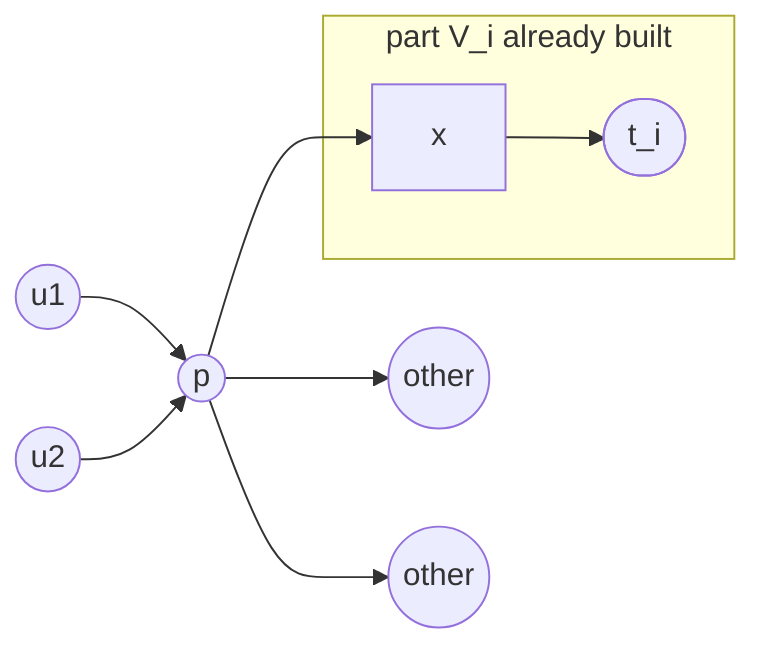
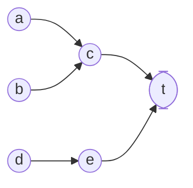

# The near-linear DAG algorithm

On directed **acyclic** graphs the Győri–Lovász partition problem becomes
almost easy: no flows, no essential terminals, no assignment condition. The
paper's [Alg 5] **GLDAGPartition** runs in $O(m\log n)$ [Thm dag-algo], and
this repository additionally implements an $O(n+m)$ variant proved in
`RESEARCH_NOTES.md` P1. Labels are those of `docs/paper_notes.md`.

Input: a DAG $D=(V,E)$ with terminals $T=\{t_1,\dots,t_k\}$ (no outgoing arcs),
non-terminal weights $w_v\ge 1$ (all $1$ in the unweighted case) and terminal
capacities $c_t\ge 0$ with $\sum_{v\in V\setminus T} w_v\le\sum_{t} c_t$.
Output: parts $V_1,\dots,V_k$ with $t_i\in V_i$, $D[V_i]$ connected to $t_i$,
and $\sum_{v\in V_i\setminus T} w_v \le c_{t_i}+w_{\max}-1$
[Lem 9.5 dag-algo-correctness]. With unit weights and $\sum_t c_t=|V\setminus T|$
the bound is exact, $|V_i|=c_i+1$ [Cor gl-dag-unweighted].

---

## 1. Canonical topological order

> **[Def 9.2 canonical topological order]** A topological order $\prec$ of $D$
> in which every non-terminal precedes every terminal and the terminals come
> last in index order: $(V\setminus T)\prec t_1\prec t_2\prec\dots\prec t_k$.

Such an order always exists precisely because terminals have no outgoing arcs:
topologically sort the non-terminals (Kahn, $O(n+m)$) and append the terminals.
Any topological order of the non-terminals works. Write $\mathrm{pos}[v]$ for
the position; $(u,v)\in E \Rightarrow u\prec v$.

## 2. The out-degree characterisation

> **[Lem 9.1 k-conn-dag]** A DAG $D$ with terminals $T$ is $k$-$T$-connected
> **iff** every non-terminal has out-degree $\ge k$.

*Necessity* is immediate: $k$ vertex-disjoint paths out of $v$ need $k$
distinct out-arcs. *Sufficiency*: if some $v$ had $\kappa_D(v)<k$, Menger
[Lem 3.4] gives a cut $C$ separating $v$ from $T$ with $|S_C|<k$; let $x$ be
the $\prec$-maximum vertex of $R_C$. By maximality $x$ has no out-arc into
$R_C$; by the cut property none into $L_C$; so all $\ge k$ out-neighbours of
$x$ lie in $S_C$ and $|S_C|\ge k$ — contradiction.

This is why the DAG solver needs **no** FEAC machinery: its precondition is a
single $O(n+m)$ scan (plus an acyclicity test). A DAG that is *not*
$k$-$T$-connected but does satisfy FEAC is simply routed to the general solver
(`paper_notes` §9).

## 3. The algorithm [Alg 5]

State: residual capacities $\hat c_t$ (initially $c_t$), the parts $V_i$
(initially $\{t_i\}$), a used-flag $\chi_v$, the active set
$T_{\text{active}}=\{t:\hat c_t>0\}$, a counter $r=|V\setminus T|$, and for
each $i$ a min-heap $H_i$ keyed by $\mathrm{pos}$ holding the pre-terminals
that currently have an arc into $V_i$.

```
compute the canonical order; H_i <- in-neighbours of t_i, keyed by pos
while r > 0:
    pick any active terminal t_i                      # policy, see §7
    p <- extract-min(H_i); if chi[p]: continue        # stale entry
    V_i += {p}; chi[p] <- true; r -= 1
    hat_c_i -= w_p;  parent[p] <- x                   # x = head of the arc that pushed p
    push every in-neighbour of p into H_i
    if hat_c_i <= 0: T_active -= {t_i}
```

`parent[p]` is recorded by pushing triples $(\mathrm{pos}[p],p,x)$, where $x$
is the vertex of $V_i$ that the arc $(p,x)$ enters; the first non-stale pop
wins. All these are **original** arcs, so $\{(p,\mathrm{parent}[p])\}$ is a
spanning in-arborescence of each part — the same certificate the general solver
emits (`docs/algorithm.md` §(h)).

### One contraction step



After contracting $p$ into $t_i$: $p$ joins $V_i$ with $\mathrm{parent}[p]=x$,
its in-neighbours $u_1,u_2$ are pushed into $H_i$ (they are the new
pre-terminals of the enlarged part), and each of $u_1,u_2$ keeps its
out-degree — the arc to $p$ simply becomes an arc to $t_i$.

## 4. Correctness

A vertex $u$ is a **common predecessor** of a pre-terminal $p$ and a terminal
$t$ if $(u,p)\in E$ and $(u,t)\in E$.

> **[Lem 9.3 dag-contract-theorem]** If $(p,t)\in E$ and $p,t$ have no common
> predecessor, contracting $p$ into $t$ keeps the DAG $k$-$T$-connected.

Fix $u\ne p$. If $(u,p)\notin E$ nothing changes. If $(u,p)\in E$ then
$(u,t)\notin E$ (else $u$ is a common predecessor), so $u$ trades its
out-neighbour $p$ for a *new* out-neighbour $t$: $d^+$ is preserved and no
parallel arc appears. Every redirected arc $(u,t)$ comes from $u\prec p\prec t$,
so the inherited order is still topological. Apply [Lem 9.1] in both
directions.

> **[Lem 9.4 contract-exists-dag]** For every terminal $t$ of a
> $k$-$T$-connected DAG with $V\setminus T\ne\emptyset$, the $\prec$-**earliest**
> pre-terminal $p$ with $(p,t)\in E$ exists and has no common predecessor with
> $t$.

Existence: $k$-$T$-connectivity means some vertex has $k$ disjoint paths to
distinct terminals, so every terminal has an in-neighbour. Now suppose $u$ were
a common predecessor: $(u,p)\in E$ forces $u\prec p$, and $(u,t)\in E$ makes
$u$ itself a pre-terminal of $t$ — strictly earlier than $p$, contradicting the
choice of $p$. Hence [Lem 9.3] applies. This is the **only** structural fact
the algorithm needs, and it is exactly why general digraphs are hard: a
$k$-$T$-connected digraph may have *no* contractible pre-terminal at all.

The heap invariant is that the unused entries of $H_i$ are exactly the
remaining pre-terminals of the contracted part $V_i$ (true initially; restored
by pushing all in-neighbours after each contraction). So the first non-stale
pop *is* the $\prec$-earliest pre-terminal of $t_i$ in the current contracted
graph, and every iteration preserves $k$-$T$-connectivity by [Lem 9.4].

**An active terminal always exists while $r>0$.** If all $\hat c_t\le 0$, the
weight already placed is $\ge\sum_t c_t\ge\sum_v w_v$, impossible while an
unassigned vertex of positive weight remains. And the heap of an active
terminal never runs dry, because the contracted graph is still
$k$-$T$-connected and [Lem 9.4] provides a pre-terminal.

**The weighted bound.** If $c_{t_i}=0$ then $t_i$ is never active and
$V_i=\{t_i\}$. Otherwise let $p$ be the last vertex added before $t_i$ goes
inactive. Just before adding $p$, $\hat c_{t_i}$ was a positive integer, so the
weight already in $V_i$ was $\le c_{t_i}-1$; adding $w_p\le w_{\max}$ gives
$\sum_{v\in V_i\setminus T} w_v \le c_{t_i}+w_{\max}-1$. If $t_i$ is still
active at the end, its weight is $<c_{t_i}$ and the bound holds a fortiori.
**Connectivity**: each added vertex has an arc into a vertex already in $V_i$;
following those arcs strictly decreases the insertion time, so every vertex of
$V_i$ reaches $t_i$ inside $D[V_i]$ [Def connected-to].

## 5. The $O(m\log n)$ analysis [Lem 9.6 algo-complexity]

The order and the initial heaps cost $O(n+m)$. Each contraction pushes the
in-neighbours of one vertex, and each vertex is contracted at most once, so
over the whole run there are $O(m)$ pushes and hence $O(m)$ pops (stale entries
included). With binary heaps each costs $O(\log n)$: **$O(m\log n)$ total**.

## 6. An $O(n+m)$ stack variant (`RESEARCH_NOTES.md` P1)

**Claim.** With the *round-robin* or *first-active* policy the same sequence of
contractions can be produced in $O(n+m)$ time; with *max-residual* in
$O(n+m+n\log k)$.

**Why the heap is overkill.** Fix a terminal $t_i$. When the algorithm pops the
minimum unused entry $p$ of $H_i$, it immediately pushes the in-neighbours of
$p$ — and every in-neighbour $u$ satisfies $u\prec p$, because $(u,p)\in E$.
Meanwhile every *other* unused entry of $H_i$ was $\succeq p$ at that moment
($p$ was the minimum). So the entries just pushed are **all smaller** than
everything else pending in $H_i$. Inductively, if we think of the pops as a
depth-first traversal of the reversed graph starting from $V_i$, pending
entries at a deeper level are always smaller than pending entries at any
shallower level. Therefore:

> the minimum unused entry of $H_i$ is always the **first unused element of the
> deepest non-exhausted level**.

That is a stack discipline, not a priority queue.

**Implementation.** Sort every in-list once by $\mathrm{pos}$ with a single
global counting sort ($O(n+m)$). Per terminal keep a stack of frames
`(vertex, pointer into its sorted in-list)`; the bottom frame is the part
itself. "Pop min" = advance the pointer of the top frame past already-used
vertices and return the first unused one, or pop the frame when its list is
exhausted. Each arc's pointer position is passed at most once over the entire
run, and the used-test is $O(1)$, so the total is $O(n+m)$. Interleaving with
other terminals only marks more vertices used, which the pointer scans skip.

**Worked example.** Non-terminals $a\prec b\prec c\prec d\prec e$ and one
terminal $t$; arcs $c\to t$, $e\to t$, $a\to c$, $b\to c$, $d\to e$.



*Heap version.* $H=\{c_3,e_5\}$; pop $c$, push $a_1,b_2$; $H=\{a_1,b_2,e_5\}$;
pop $a$; pop $b$; pop $e$, push $d_4$; pop $d$. Order: $c,a,b,e,d$.

*Stack version.* Frame 0 is $t$ with sorted in-list $[c,e]$. Take $c$; push
frame $c$ with $[a,b]$. Deepest frame gives $a$ (frame $a$ has an empty list
and is popped), then $b$ (same), then frame $c$ is exhausted and popped, so
frame 0 continues with $e$; push frame $e$ with $[d]$, take $d$. Order:
$c,a,b,e,d$ — identical, with no comparisons beyond the pointer walk. Note how
the pending $e_5$ at frame 0 was never a candidate while frame $c$ still had
$a_1,b_2$ pending: deeper is always smaller.

Since the contraction sequence is identical, every correctness lemma of §4
applies unchanged. The core exposes it as `dag_partition(..., linear=True)`;
tests assert the two variants return identical output and the benchmarks
compare them (`docs/optimizations.md` O10).

## 7. Terminal-selection policies (`paper_notes` §13.7)

[Alg 5] says "pick **any** active terminal", and the correctness proof never
uses which one — the heap invariant and [Lem 9.4] hold per terminal. The
implementation offers:

| policy | rule | note |
|---|---|---|
| `max_residual` | largest $\hat c_t$, ties by terminal index | default; balances growth, needs a $\le k$-element priority queue ($O(n\log k)$ extra) |
| `round_robin` | cycle through the active set | $O(1)$ per step; compatible with the $O(n+m)$ stack variant |
| `first` | smallest terminal index | $O(1)$ per step; also $O(n+m)$ |

With unit weights the choice cannot affect validity (every part ends at
exactly $c_i+1$ vertices); with general weights it changes only *which* valid
partition is produced, never whether the bound $c_t+w_{\max}-1$ holds.

## 8. Runtime summary

| variant | bound |
|---|---|
| [Alg 5] with binary heaps [Lem 9.6] | $O(m\log n)$ |
| stack variant, `round_robin` / `first` (P1) | $O(n+m)$ |
| stack variant, `max_residual` (P1) | $O(n+m+n\log k)$ |
| precondition test [Lem 9.1] + acyclicity | $O(n+m)$ |

---

## Where this lives in the code

From the lemma → function map of `docs/paper_notes.md` §12, plus the adjacent
entry points of the DAG module:

| Paper item | Reference (`reference/glref`) | Optimized (`src/`) |
|---|---|---|
| Alg 5 GLDAGPartition | `dag.gl_dag_partition` | `glcore::dag_partition` |
| Lem 9.1 out-degree test | `dag.is_k_t_connected_dag` | same |
| Def 9.2 canonical order | `dag.canonical_topological_order` | same |
| Def 2.1 contraction (simulated) | `dag` keeps `part_of[]`, no graph mutation | `glcore::Graph::contract` |
| Verifier (independent) | `glsolver.verify.verify_partition` | pure Python, no shared code |

`glref.dag.dag_precondition` returns the offending vertex when [Lem 9.1] fails
(out-degree $<k$, or a vertex on a cycle) and the solver reports
`precondition_failed` with that vertex in the message. In `debug=True` the
reference checks, before each contraction, that $p$ and the part of $t_i$ have
no unused common predecessor ([Lem 9.4]) and, after it, that no unused
non-terminal lost out-degree in the simulated contracted graph ([Lem 9.3]).
