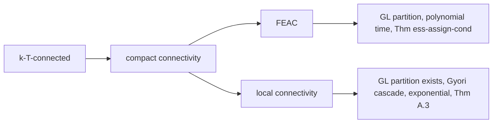

# Flow-essential assignment: the condition behind the algorithm

The single idea that turns Győri–Lovász from a topological existence theorem
into a polynomial-time algorithm is the **Flow-Essential Assignment Condition**
(FEAC) of arXiv:2608.30945 and its weighted relative FESAC. This document
collects the definitions, the two equivalent views, how witnesses are computed,
why the condition survives the algorithm's operations, where it sits between
$k$-$T$-connectivity and the older relaxations, and a sketch of the one lemma
whose proof really needs the cut lattice. Labels are those of
`docs/paper_notes.md`.

Setting throughout (`paper_notes` §1.2, §2): a simple digraph $G=(V,E)$,
terminals $T=\{t_1,\dots,t_k\}$ with **no outgoing arcs**, capacities
$c_t\ge 0$. $PT(G,S)$ denotes the pre-terminals with an arc into $S\subseteq T$
[Def 2.1].

---

## 1. Essential terminals

> **[Def 3.2 terminal connectivity]** $\kappa_G(v)$ is the maximum size of a
> family of paths from the non-terminal $v$ to **distinct** terminals, pairwise
> vertex-disjoint except at $v$. $G$ is *$k$-$T$-connected* if
> $\kappa_G(v)=k$ for every non-terminal $v$.

> **[Def 4.1 flow-essential terminal]** A terminal $t$ is **essential** for a
> non-terminal $v$ if $\kappa_{G\setminus\{t\}}(v)=\kappa_G(v)-1$.
> $\mathrm{Ess}_G(v)$ is the set of terminals essential for $v$.

Read it as: *$t$ is a bottleneck for $v$*. Deleting a terminal can lower
$\kappa$ by at most one (drop the one path that ends there), so the definition
says the drop actually happens — no maximum path family can avoid $t$.

### The two views

**Path view.** $t\in\mathrm{Ess}_G(v)$ iff **every** maximum family of
vertex-disjoint $v\to T$ paths contains a path ending at $t$. Equivalently, no
family of $\kappa_G(v)$ disjoint paths avoids $t$.

**Cut view.** Recall [Def 3.3]: a cut separating $v$ from $T$ is a partition
$C=(L_C,S_C,R_C)$ of $V$ with $v\in R_C$, $T\subseteq L_C\cup S_C$ and no arc
from $R_C$ to $L_C$; $|C|=|S_C|$; Menger [Lem 3.4] gives
$\kappa_G(v)=\min_C |C|$. Among the minimum cuts there is a canonical one:

> **[Def 3.8 tightest minimum cut]** the intersection of all minimum cuts
> separating $v$ from $T$ (smallest $L$, largest $R$); it is itself a minimum
> cut, and for every minimum cut $C'$: $L_C\subseteq L_{C'}$,
> $R_{C'}\subseteq R_C$ [Lem 3.9].

> **[Lem 4.1 essential ⇔ tightest cut]** $t$ is essential for $v$ **iff**
> $t\in S_C$, where $C$ is the tightest minimum cut separating $v$ from $T$.

Terminals never lie in $R_C$; so under the cut view, $T$ splits into the
*essential* ones (in the separator) and the rest (in $L_C$). By [Lem 3.9] a
terminal in the separator of *any* minimum cut is already in $S_C$, hence
essential.

The two views feed different parts of the proof. The path view drives the
**rerouting** arguments ([Lem 7.7], [Lem 7.9], [Lem 7.12]'s claim): take a
family avoiding $t$, reroute the path through a matched pre-terminal $p_i$
along $(p_i,t_i)$, contradiction. The cut view drives the **counting**
arguments, because cuts are closed under union and intersection and their sizes
add modularly.

### Cut union and intersection [Def 3.5]

Row = membership in $C_1$, column = membership in $C_2$, entry = membership in
the result.

**Union $C_1\cup C_2$** ($L = L_1\cup L_2$, $R = R_1\cap R_2$, rest $S$):

| | $L_2$ | $S_2$ | $R_2$ |
|---|---|---|---|
| **$L_1$** | $L$ | $L$ | $L$ |
| **$S_1$** | $L$ | $S$ | $S$ |
| **$R_1$** | $L$ | $S$ | $R$ |

**Intersection $C_1\cap C_2$** ($L = L_1\cap L_2$, $R = R_1\cup R_2$, rest $S$):

| | $L_2$ | $S_2$ | $R_2$ |
|---|---|---|---|
| **$L_1$** | $L$ | $S$ | $R$ |
| **$S_1$** | $S$ | $S$ | $R$ |
| **$R_1$** | $R$ | $R$ | $R$ |

> **[Lem 3.6]** Both are valid cuts separating $v$ from $T$, and
> $|C_1|+|C_2|=|C_1\cup C_2|+|C_1\cap C_2|$.
> **[Cor 3.7]** Minimum cuts are closed under union and intersection.

### Computing $\mathrm{Ess}_G(v)$ [Prop 4.2]

One max-flow on the vertex-split network $H_v$: nodes $x_{\text{in}},
x_{\text{out}}$ with split arc capacity $1$ (capacity $K=k+1$ for $x=v$); every
arc $(x,y)\in E$ becomes $(x_{\text{out}},y_{\text{in}})$ with capacity $K$;
source $\to v_{\text{in}}$ and every $t_{\text{out}}\to$ sink with capacity
$K$. The value is $\kappa_G(v)\le k$, so at most $k$ BFS augmentations are
needed. Let $\mathrm{Reach}$ be the nodes that reach the sink in the residual
graph; then $x_{\text{in}}\in\mathrm{Reach}\Rightarrow
x_{\text{out}}\in\mathrm{Reach}$, so

$$L=\{x: x_{\text{in}}\in\mathrm{Reach}\},\quad
S=\{x: x_{\text{in}}\notin\mathrm{Reach},\ x_{\text{out}}\in\mathrm{Reach}\},\quad
R=\{x: x_{\text{out}}\notin\mathrm{Reach}\}$$

is the tightest minimum cut, $|S|=\kappa_G(v)$, and
$\mathrm{Ess}_G(v)=S\cap T$. The literal $k{+}1$-flow definition is kept as a
cross-check in the tests.

One more fact, used everywhere:

> **[Lem 4.3 essential-connectivity]** For any arc $e$,
> $\kappa_{G\setminus e}(v)\ge\kappa_G(v)-1$; and if
> $\kappa_{G\setminus e}(v)=\kappa_G(v)$, then
> $\mathrm{Ess}_G(v)\subseteq\mathrm{Ess}_{G\setminus e}(v)$.

(The generalization to an arc *set* $E'$ has the same one-line proof and is the
basis of optimization O1 in `docs/optimizations.md`.)

---

## 2. The conditions

> **[Def 5.0 assignment]** $\varphi: V\setminus T\to T$; $\varphi^{-1}(t)$ is
> the set of vertices assigned to $t$.

> **[Def 5.1 FEAC]** $(G,T,c)$ satisfies the *Flow-Essential Assignment
> Condition* if there is a $\varphi$ with (1) $\varphi(v)\in\mathrm{Ess}_G(v)$
> for every non-terminal $v$, and (2) $|\varphi^{-1}(t)|=c_t$ for every
> terminal $t$. Such a $\varphi$ is a **witness**. Requires
> $\sum_t c_t=|V\setminus T|$.

The two requirements marry the two sides of the problem: (1) is the *cut* side
— every vertex is sent into its own bottleneck; (2) is the *counting* side —
every capacity is met exactly.

For weights, both are relaxed:

> **[Def 5.2 split-assignment]** $\psi:(V\setminus T)\times T\to\mathbb{N}$
> with $\sum_t \psi(v,t)=w_v$; $\psi(v)=\{t:\psi(v,t)>0\}$.

> **[Def 5.3 FESAC]** $(G,T,c,w)$ satisfies the *Flow-Essential
> Split-Assignment Condition* if some $\psi$ has (1) $\psi(v,t)>0 \Rightarrow
> t\in\mathrm{Ess}_G(v)$ and (2) $\sum_v \psi(v,t)\le c_t$ — an **upper bound**,
> not an equality.

Two relaxations happen at once: a vertex may split its weight over several
essential terminals, and capacities are only upper bounds (so $\sum_t c_t$ may
exceed $\sum_v w_v$). FESAC restricted to $w\equiv 1$ and
$\sum_t c_t=|V\setminus T|$ is exactly FEAC, because the upper bounds then
have to be met with equality.

### Computing a witness

**FEAC (unweighted).** Bipartite max-flow: source $\to v$ with capacity $1$;
$v\to t$ with capacity $1$ **iff** $t\in\mathrm{Ess}_G(v)$; $t\to$ sink with
capacity $c_t$. FEAC holds iff the value is $|V\setminus T|$; the saturated
middle arcs are $\varphi$. This is the algorithmic content of
[Thm ess-assign-cond].

**FESAC (weighted), [Prop 5.4].** The same network with capacities $w_v$ on
$s\to v$ and on $v\to t$, plus **costs** $\xi_v(t)$ on the middle arcs: a
min-cost flow of value $W=\sum_v w_v$ is a witness minimizing
$\sum_{v,t}\psi(v,t)\,\xi_v(t)$; infeasibility means FESAC fails. The network
has $O(n)$ nodes and $O(nk)$ arcs; with costs bounded by $|V|$ and capacities
by $n w_{\max}$ the bound is
$O\!\left(n(n+m)^{1+o(1)}+(nk)^{1+o(1)}\log(n w_{\max})\log n\right)$ —
polynomial **even for exponentially large weights**, which is precisely why the
weighted algorithm replaces cycle shifts by one min-cost flow
(`docs/weighted_algorithm.md`).

If no witness exists, the solver reports `precondition_failed`: the theorem's
guarantee does not apply. It never concludes that no partition exists
(`paper_notes` §13.9).

---

## 3. Why the condition is maintainable

This is the whole point. $k$-$T$-connectivity is *not* preserved by the
algorithm's operations; FEAC is. Three preservation lemmas carry the induction
of [Thm gl-partition-correctness], one per operation of [Alg 1]:

1. **Terminal removal** — [Lem 7.1 essential-survives-terminal-removal]: if
   $t'\ne t$ is essential for $v$ in $G$, it stays essential in
   $G\setminus\{t\}$. Proof by the cut view: take the tightest cut $C$ for $v$;
   if $t\in L_C$ then $\kappa$ is unchanged and $S_C$ still separates; if
   $t\in S_C$ then $\kappa$ drops by one and $(L_C,S_C\setminus\{t\},R_C)$ is a
   minimum cut of $G\setminus\{t\}$ — in both cases $t'$ stays in a separator.
   Hence [Lem 7.2]: if $c_t=0$, removing $t$ keeps FEAC with the *same*
   $\varphi$ (no vertex was assigned to $t$).
   *Caveat*: the converse fails — **new** essential terminals can appear
   (`paper_notes` §13.3), so $\mathrm{Ess}$ must be recomputed after this step.

2. **Contraction of an out-degree-one pre-terminal** —
   [Lem 7.3 essential-survives-degree-one-contraction]: contracting $p$ with
   $d^+(p)=1$, $(p,t)\in E$, leaves every essentiality intact. The proof is a
   bijection on path families (any family through $p$ must end $\dots p\to t$;
   contract it; conversely expand a contraction-created arc into the two-arc
   path through $p$, legal because only one path can end at $t$), so the sets
   of *realizable terminal endpoints* coincide: $\kappa$ and $\mathrm{Ess}$ are
   literally unchanged (`paper_notes` §13.2 — no recomputation). Hence
   [Lem 7.4]: FEAC survives with $c_t \mathrel{-}= 1$ and
   $\varphi'=\varphi\setminus\{p\}$.

3. **Arc deletion** — [Lem 7.5 non-critical-edge-exists]: when (1) and (2) do
   not apply, ShiftAssignment produces a witness $\varphi'$ and an arc
   $e_{\mathrm{nc}}$ that is *critical* [Def 6.1] for no pair
   $(v,\varphi'(v))$; deleting it therefore preserves every
   $\varphi'(v)\in\mathrm{Ess}(v)$, i.e. FEAC. See `docs/algorithm.md` §(e).

The weighted analogues are [Lem 8.1], [Lem 8.2], [Lem 8.5] plus
[Lem 8.8 preservation after rounding] for the extra operation; see
`docs/weighted_algorithm.md`.

A useful corollary of the induction (`paper_notes` §13.1): the proof only ever
uses "FEAC holds in the graph passed to the recursive call". So **any** arc set
$D$ with $\varphi(v)\in\mathrm{Ess}_{G\setminus D}(v)$ for all $v$ may be
deleted at once; ShiftAssignment is only the paper's *guarantee* that a
deletable arc exists.

---

## 4. Where FEAC sits

**$k$-$T$-connectivity $\Rightarrow$ FEAC.** If $\kappa_G(v)=k$ for every $v$,
then for every terminal $t$ the $k-1$ remaining terminals bound
$\kappa_{G\setminus\{t\}}(v)\le k-1$, so *every* terminal is essential for
*every* vertex: $\mathrm{Ess}(v)=T$. Any capacity-respecting assignment is then
a witness, and [Thm k-t-conn] drops out of [Thm ess-assign-cond] as a special
case. The same argument with split weights gives
[Thm weighted-k-t-conn] from [Thm gyori-weighted-poly].

**Compact connectivity $\Rightarrow$ FEAC.** $v$ is *compact-connected* to $t$
[Def A.5] if there are $k$ internally vertex-disjoint $v\to T$ paths in which
every terminal $t'\ne t$ receives at most one path (several may end at $t$; a
pre-terminal of $t$ counts as compact-connected to $t$ by convention). The
condition asks $|\bigcup_{t\in T'}\mathcal{C}(t)|\ge\sum_{t\in T'}c_t$ for all
$T'\subseteq T$, equivalently (Hall) that a capacity-exact assignment $\sigma$
with $v\in\mathcal{C}(\sigma(v))$ exists [Lem A.6]. Then
[Lem A.11 compact-connected ⇒ essential] applies: if $t$ were *not* essential
for $v$, then $t\in L_C$ for the tightest cut $C$, every one of the $k$ paths
must hit $S_C$, and the first hits are distinct (two paths may only share $t$,
which is in $L_C$), so $|S_C|\ge k$, i.e. $\kappa_G(v)=k$ — but then removing
$t$ leaves only $k-1$ terminals and $\kappa$ must drop, so $t$ *is* essential,
a contradiction. Hence $\sigma$ itself witnesses FEAC [Lem A.12].
Recognition of compact connectivity costs one vertex-split flow per pair
$(v,t)$ plus one bipartite flow [Lem A.9].

**But compact connectivity is not maintainable.** The paper's appendix exhibits
instances where no arc can be deleted and no pre-terminal contracted without
destroying compact connectivity ([Lem A.13] proves the "every arc is critical"
half; the authors' repository contains the full 17-copy instance with $k=9$,
108 pre-terminals and 3672 forcing vertices, `paper_notes` §10). That instance
still satisfies FEAC — compact $\Rightarrow$ FEAC — so the general solver must
and does solve it; it is kept as a regression test of exactly the phenomenon
that FEAC was invented to survive.

**FEAC is strictly weaker than $k$-$T$-connectivity.** The paper's running
example (`docs/algorithm.md` §(b)): $k=3$, non-terminals $v_4,\dots,v_9$,
capacities $(2,2,2)$, arcs $(v_8,v_4),(v_8,v_5),(v_5,v_4),(v_4,t_1),(v_4,t_2),
(v_5,t_2),(v_9,v_6),(v_9,v_7),(v_6,v_7),(v_6,t_2),(v_7,t_2),(v_7,t_3)$. Every
non-terminal has $\kappa=2<3=k$, so the instance is **not** $3$-$T$-connected
and Lovász's theorem says nothing. Yet the tightest cuts give
$\mathrm{Ess}(v_4)=\mathrm{Ess}(v_5)=\mathrm{Ess}(v_8)=\{t_1,t_2\}$ and
$\mathrm{Ess}(v_6)=\mathrm{Ess}(v_7)=\mathrm{Ess}(v_9)=\{t_2,t_3\}$, and
$\varphi=\{v_4\mapsto t_2, v_5\mapsto t_1, v_6\mapsto t_3, v_7\mapsto t_2,
v_8\mapsto t_1, v_9\mapsto t_3\}$ is a witness: essential everywhere, exactly
two vertices per terminal. FEAC holds, and [Alg 1] partitions the instance.

The other relaxation in the appendix, **local connectivity** [Def A.2], is
weaker still and does imply that a partition exists [Thm A.3], but only through
Győri's cascade argument, whose search space can be exponential
(`paper_notes` §10). It is not implemented as a solver.

---

## 5. Proof idea of the transfer-of-criticality lemma [Lem 7.12]

This is the one place where the cut lattice does real work. With the matching
$\{(p_i,t_i)\}$ and secondary arcs $e_i=(p_i,q_i)$ of [Alg 2]:

> **[Lem 7.12 critical-transfer]** If $e_i$ is critical for $(v,t)$, then every
> $e_j$ critical for $(v,t_i)$ is also critical for $(v,t)$.

Suppose not: $e_j$ is critical for $(v,t_i)$ but not for $(v,t)$. Write
$\kappa=\kappa_G(v)$, $G_i=G\setminus e_i$, $G_j=G\setminus e_j$,
$H=G\setminus\{e_i,e_j\}$. Criticality plus [Lem 4.3] force
$\kappa_{G_i}(v)=\kappa_{G_j}(v)=\kappa-1$, and a rerouting argument (take the
$\kappa-1$ paths in $G_j$ avoiding $t_i$; if one uses $e_i$, redirect it at
$p_i$ along $(p_i,t_i)$) gives $\kappa_H(v)=\kappa-1$ as well. So the tightest
cuts $C_i$ of $G_i$ and $C_j$ of $G_j$ are *both minimum cuts in $H$*, of size
$\kappa-1$.

Now read off positions with [Lem 4.1]: $t\in L_{C_i}$, $t_i\in S_{C_i}$,
$t\in S_{C_j}$, $t_i\in L_{C_j}$. Because $C_i$ has size $\kappa-1<\kappa$ it
cannot be valid in $G$, and the only arc of $G$ missing from $G_i$ is $e_i$, so
$e_i$ must cross $C_i$ from right to left: $p_i\in R_{C_i}$, $q_i\in L_{C_i}$;
symmetrically $p_j\in R_{C_j}$, $q_j\in L_{C_j}$.

Apply [Cor 3.7] in $H$. In the **intersection** $C_i\cap C_j$ both $t$ and
$t_i$ land in the separator (table above), so the intersection cannot be valid
in $G_i$ or in $G_j$ — otherwise [Lem 3.9] + [Lem 4.1] would make $t$ essential
in $G_i$, or $t_i$ essential in $G_j$. Hence both $e_i$ and $e_j$ cross
$C_i\cap C_j$ from right to left, which pins
$q_i,q_j\in L_{C_i}\cap L_{C_j}$. Validity of $C_i$ in $G_i$ (which still
contains $e_j$) then forces $p_j\in L_{C_i}\cup S_{C_i}$, and symmetrically
$p_i\in L_{C_j}\cup S_{C_j}$.

Finally look at the **union** $C_i\cup C_j$: it is a valid cut of $H$ of size
$\kappa-1$ (by [Lem 3.6] and minimality), both $t,t_i$ sit in its left side,
and by the positions just derived $p_i,p_j\in L\cup S$ while $q_i,q_j\in L$.
So neither $e_i$ nor $e_j$ crosses it from right to left — adding both arcs
back leaves it a **valid cut of $G$ of size $\kappa-1$**, contradicting
$\kappa_G(v)=\kappa$. $\square$

Together with [Lem 7.10 own-edge-not-critical] ($e_i$ is never critical for
$(v,t_i)$) this gives $\xi_v(t_i)<\xi_v(\varphi(v))$ whenever $e_i$ is critical
for $(v,\varphi(v))$, which is exactly the strict decrease of the potential
[Def 6.3] along a cycle shift [Lem 7.11]. The same two lemmas, unchanged, drive
the weighted potential $\bar\Phi$ and hence [Lem 8.5].

---

## Where this lives in the code

From the lemma → function map of `docs/paper_notes.md` §12, plus the cut
helpers used by the tests:

| Paper item | Reference (`reference/glref`) | Optimized (`src/`) |
|---|---|---|
| Prop 4.2 tightest cut / Ess | `essential.tightest_min_cut`, `essential.essential_terminals` | `glcore::EssentialOracle` |
| Def 4.1 ($k{+}1$-flow cross-check) | `essential.essential_terminals_by_definition` | tests only |
| Def 3.5 union / intersection of cuts | `flow.cut_union`, `flow.cut_intersection` | — |
| Def 5.1 witness | `assignment.find_witness` | `glcore::find_witness` |
| Prop 5.4 min-cost split assignment | `weighted.min_cost_split_assignment` | `glcore::min_cost_split_assignment` |
| Def 6.1 criticality | `critical.is_critical`, `critical.criticality_table` | `glcore::CriticalityOracle` |
| Lem 7.8 matching | `matching.saturating_matching` | `glcore::hopcroft_karp` |
| Lem A.9 compact connectivity | `compact.compact_sets`, `compact.satisfies_condition` | — |
| Verifier (independent) | `glsolver.verify.verify_partition` | pure Python, no shared code |

`glref.assignment.is_witness` and `glref.weighted.is_split_witness` check
[Def 5.1] / [Def 5.3] against precomputed essential sets and are what the
debug assertion A1 of `paper_notes` §7.2 calls after every operation.
