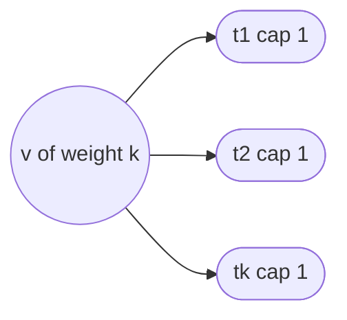

# The weighted algorithm

**GLWeightedPartition** [Alg 3] and its subroutine **RoundAndRemove** [Alg 4]
generalize `docs/algorithm.md` to vertices with integer weights. The result is
the algorithmic version of the existence theorem of Chen–Kleinberg–Lovász–
Rajaraman–Sundaram–Vetta that underlies their confluent-flow work, and it is
also the *faster* way to solve unweighted instances, because one min-cost flow
replaces up to $k|V\setminus T|$ cycle shifts. Labels are those of
`docs/paper_notes.md`.

---

## 1. Weights, capacities, and the unavoidable slack

Each non-terminal $v$ carries an integer weight $w_v\ge 1$; each terminal $t$ a
capacity $c_t\ge 0$; and

$$\sum_{v\in V\setminus T} w_v \;\le\; \sum_{t\in T} c_t ,$$

an **inequality** — capacities may exceed the total weight. Write
$w_{\max}=\max_v w_v$.

> **[Thm weighted-k-t-conn]** If $G$ is $k$-$T$-connected there is a
> polynomial-time algorithm producing parts $\langle V_t\rangle_{t\in T}$ with
> $t\in V_t$, $G[V_t]$ connected to $t$, and
> $$\sum_{v\in V_t\setminus T} w_v \;\le\; c_t + w_{\max}-1 .$$

The additive slack $w_{\max}-1$ is **not an artifact of the algorithm**; it is
forced. The paper's example: $k$ terminals of capacity $1$ and a single
non-terminal $v$ of weight $k$ with an arc to every terminal.



The instance is $k$-$T$-connected and $\sum w = k = \sum c$, but any partition
puts $v$ in exactly one part, whose weight $k$ exceeds that part's capacity by
$k-1=w_{\max}-1$. No algorithm can do better, so the bound is tight.

Unit weights with $\sum_t c_t=|V\setminus T|$ recover the exact unweighted
theorem: the bound reads $|V_t\setminus T|\le c_t$, and equality of the two
sums forces $|V_t\setminus T| = c_t$ for every $t$.

---

## 2. FESAC, the weighted condition

Exact-capacity flow-essential assignments can fail to exist even in a
$k$-$T$-connected weighted graph (a vertex of weight $5$ cannot be split
between two terminals of capacity $3$ under [Def 5.1]). Two relaxations fix it.

> **[Def 5.2 split-assignment]** $\psi:(V\setminus T)\times T\to\mathbb{N}$
> with $\sum_t\psi(v,t)=w_v$ for every non-terminal $v$;
> $\psi(v)=\{t:\psi(v,t)>0\}$, $\psi^{-1}(t)=\{v:\psi(v,t)>0\}$.

> **[Def 5.3 Flow-Essential Split-Assignment Condition, FESAC]** there is a
> $\psi$ with (1) $\psi(v,t)>0\Rightarrow t\in\mathrm{Ess}_G(v)$ and
> (2) $\sum_v \psi(v,t)\le c_t$ — an **upper bound**, not an equality.

> **[Thm gyori-weighted-poly]** FESAC suffices: a valid weighted partition with
> the $c_t+w_{\max}-1$ bound is computable in polynomial time.

$k$-$T$-connectivity implies FESAC for the same reason as in the unweighted
case: every terminal is essential for every vertex, and since
$\sum w\le\sum c$ the weights can be distributed inside the capacities — so
[Thm weighted-k-t-conn] is the special case. See
`docs/flow_essential_assignment.md` for the general picture.

**Computing a witness [Prop 5.4].** Source $\to v$ with capacity $w_v$, cost
$0$; $v\to t$ with capacity $w_v$ and cost $\xi_v(t)$, present **only** for
essential pairs; $t\to$ sink with capacity $c_t$, cost $0$. A min-cost integral
flow of value $W=\sum_v w_v$ is a minimum-potential witness; infeasibility
means FESAC fails. The network has $O(n)$ nodes, $O(nk)$ arcs, costs
$\le |V|$, capacities $\le n w_{\max}$.

---

## 3. The four operations [Alg 3]

```
loop while non-terminals remain:
  (i)   some c_t == 0            -> remove t;  parts[t] = {t}          [Lem 8.1]
  (ii)  pre-terminal p, d+(p)=1, (p,t) in E
                                 -> contract p into t; c_t -= w_p      [Lem 8.2]
  (iii) a matching from PT(G,T) saturating T exists
                                 -> secondary arcs, criticality costs,
                                    psi = MinCostSplitAssignment,
                                    delete a secondary arc critical for
                                    no pair with psi(v,t) > 0          [Lem 8.5]
  (iv)  otherwise                -> RoundAndRemove                     [Alg 4]
```

**(i) Remove a saturated terminal** [Lem 8.1 frac-remove-saturated-terminal].
$c_t=0$ forces $\psi(\cdot,t)=0$, so restricting $\psi$ to $T\setminus\{t\}$
keeps every vertex's total weight; old essentialities survive by [Lem 7.1].
$V_t=\{t\}$ is a valid part (weight $0$).

**(ii) Contract an out-degree-one pre-terminal** [Lem 8.2]. $t$ is $p$'s only
essential terminal, so $\psi(p,t)=w_p$ and therefore $c_t\ge w_p$: the updated
capacity $c_t-w_p$ is $\ge0$. Essentialities are unchanged by [Lem 7.3]
(`paper_notes` §13.2). Expanding a contraction-created arc back into its
two-arc path through $p$ keeps the part connected, and the new part weight is
at most $(c_t-w_p)+w_{\max}-1+w_p = c_t+w_{\max}-1$.

**(iii) Delete a non-critical secondary arc** [Lem 8.5
weighted-matching-removable-edge]. All $c_t>0$ and all pre-terminals have
$d^+\ge2$. Take a matching $M=\{(p_i,t_i)\}$ saturating $T$, secondary arcs
$e_i=(p_i,q_i)\ne(p_i,t_i)$, criticality costs
$\xi_v(t)=|\{i:e_i \text{ critical for } (v,t)\}|$ [Def 6.2], and let $\psi$ be
a **minimum-potential** witness for $\bar\Phi(\psi)=\sum_{v,t}\psi(v,t)\xi_v(t)$
[Def weighted potential] from one min-cost flow [Prop 5.4]. Then some $e_i$ is
critical for no pair $(v,t)$ with $\psi(v,t)>0$, and deleting it keeps $\psi$ a
witness — see §4.

**(iv) RoundAndRemove** [Alg 4] — §5.

Unlike the unweighted solver, the weighted one does **not** carry $\psi$ along:
FESAC is an existence property preserved by all four operations
([Lem 8.1], [Lem 8.2], [Lem 8.5], [Lem 8.8]), so the min-cost flow in step
(iii) is always feasible and $\psi$ is recomputed from scratch each time.

---

## 4. Why a min-cost flow replaces cycle shifts

In the unweighted algorithm the witness is repaired by cycle shifts whose
potential $\Phi$ drops by at least one per shift, and the run is bounded by
$\Phi\le k|V\setminus T|$ [Lem 7.11]. The weighted potential
$\bar\Phi(\psi)=\sum_{v,t}\psi(v,t)\,\xi_v(t)$ is bounded only by
$k\sum_v w_v$, which is **exponential in the input size** when the weights are
given in binary. Iterating shifts would not be polynomial.

The fix is to *skip to the optimum*. The shift argument is still valid, and it
is used only as a **proof by contradiction**:

> **[Lem 8.4 cycle shift decreases the weighted potential]** If every $e_i$ is
> critical for some pair $(v_i,s_i)$ with $\psi(v_i,s_i)>0$, the reassignment
> graph $\mathcal{R}$ on $T$ with arcs $s_i\to t_i$ labelled $v_i$ has
> in-degree one at every terminal, hence a directed cycle, of length $\ge2$
> because [Lem 7.10 own-edge-not-critical] rules out $s_i=t_i$. Shifting **one
> unit** of weight along that cycle ($\psi(v_i,t_{i-1})\!-\!1$,
> $\psi(v_i,t_i)\!+\!1$) yields another FESAC witness with strictly smaller
> $\bar\Phi$: each $t_i$ is essential for $v_i$ by
> [Lem 7.9 critical-implies-assignable], each terminal on the cycle loses and
> gains one unit, and $\xi_{v_i}(t_i)<\xi_{v_i}(t_{i-1})$ by [Lem 7.10] plus
> [Lem 7.12 critical-transfer].

Apply this to a **minimizer** $\psi$ of $\bar\Phi$: the hypothesis cannot hold,
otherwise the shifted witness would be cheaper. Hence some $e_i$ is critical
for no pair with $\psi(v,t)>0$; deleting it preserves the essentiality of every
terminal actually receiving weight, so the *same* $\psi$ witnesses FESAC in
$G\setminus e_i$ [Lem 8.5]. One min-cost flow does the work of an unbounded
number of shifts, and the three cut lemmas [Lem 7.9], [Lem 7.10], [Lem 7.12]
are reused verbatim — they were deliberately stated without reference to an
assignment.

This is also why running [Alg 3] on an unweighted instance is faster than
[Alg 1]: the potential argument is discharged by one flow per step
(`paper_notes` §8).

---

## 5. RoundAndRemove [Alg 4]

Step (iii) needs a matching from $PT(G,T)$ to $T$ saturating $T$. In the
*unweighted* setting such a matching always exists [Lem 7.8], because positive
capacities force $\ge|S|$ distinct vertices to be assigned into any
Hall-deficient $S$. With **split** assignments that argument breaks: one vertex
can feed several terminals of $S$ at once. When the matching is missing, the
algorithm finishes those parts by rounding.

```
S    <- inclusion-minimal nonempty S subset of T with no saturating matching
        (equivalently inclusion-minimal with |S| > |PT(G,S)|)
t_S  <- any terminal of S
M'   <- matching from S \ {t_S} onto PT(G,S), saturating both sides
parts[t_S]        = {t_S}
parts[t]          = {t, M'(t)}   for t in S \ {t_S}
delete S and PT(G,S) from the graph;  T <- T \ S
```

> **[Lem 7.6 minimal-hall-set]** For an inclusion-minimal $S$ with
> $|S|>|PT(G,S)|$: every proper subset satisfies Hall's condition,
> $|PT(G,S)|=|S|-1$, and for every $t\in S$ there is a matching from
> $S\setminus\{t\}$ onto $PT(G,S)$ saturating **both** sides.

So the $|S|-1$ removed pre-terminals are distributed one per terminal, and
$t_S$ gets nothing.

**Finding $S$** (proof of [Thm gyori-weighted-poly]): start with $S=T$
(deficient by assumption); scan $t\in S$ and whenever $S\setminus\{t\}$ is
still not saturable, set $S:=S\setminus\{t\}$ and restart the scan. The empty
set is saturable, so the process stops at a nonempty $S$ in
$\le|T|^2$ matching tests; when it stops, every $S\setminus\{t\}$ — and hence
every proper subset — is saturable, which is exactly minimality. Shortcut used
in the implementation: a terminal with no pre-terminal neighbour is already a
singleton deficient set.

**[Lem 8.6 rounded parts are valid].** $V_{t_S}=\{t_S\}$ has weight $0$;
$V_t=\{t,M'(t)\}$ is connected because $M'(t)$ has an arc to $t$; and since
capacities are positive integers, $w_{M'(t)}\le w_{\max}\le c_t+w_{\max}-1$.
**Operation (iv) is the only place where a part can exceed $c_t$**, and it does
so by at most $w_{\max}-1$.

### Preservation after rounding, in two steps

The delicate part is that the *remaining* instance must still satisfy FESAC.
Restricting $\psi$ is fine on the counting side — by
[Lem 7.7 hall-deficient-not-essential-outside] no terminal of $S$ is essential
for a vertex outside $PT(G,S)$, so no surviving vertex sent weight into $S$,
and removing vertices can only lower what each remaining terminal receives. The
work is on the essentiality side:

> **[Lem 8.7 essentiality survives rounding]** If $t\in T\setminus S$ is
> essential for $v\in(V\setminus T)\setminus PT(G,S)$ in $G$, it is still
> essential after deleting $S\cup PT(G,S)$ and setting $T':=T\setminus S$.

The proof goes through an **intermediate instance with temporary terminals**.
Let $H$ be $G\setminus S$ with all *outgoing* arcs of $PT(G,S)$ deleted, and
let $T_H:=(T\setminus S)\cup PT(G,S)$ — the removed pre-terminals are promoted
to terminals.

*Step 1: $t$ is essential for $v$ in $(H,T_H)$.* First $\kappa_H=\kappa_G$.
($\ge$) Truncate every maximum path family of $G$ at its first vertex in
$PT(G,S)$: prefixes stay disjoint, paths that ended in $S$ now end at distinct
members of $PT(G,S)$, the others end in $T'$. ($\le$) Take the tightest cut
$C$ of $v$ in $G$; by [Lem 7.7] no terminal of $S$ is essential for $v$, so by
[Lem 4.1] $S\cap S_C=\emptyset$ and hence $S\subseteq L_C$; and
$PT(G,S)\subseteq L_C\cup S_C$, since a pre-terminal in $R_C$ would have an arc
from $R_C$ into $L_C$. Therefore $C_H:=(L_C\setminus S,\,S_C,\,R_C)$ is a valid
cut of $(H,T_H)$ with the *same* separator, giving $\kappa_H\le\kappa_G$. So
$C_H$ is a minimum cut of $H$ containing $t\in S_C$ in its separator, and by
[Lem 3.9] + [Lem 4.1] $t$ is essential for $v$ in $(H,T_H)$.

*Step 2: remove the temporary terminals one at a time.* Each of them is
distinct from $t$, so [Lem 7.1 essential-survives-terminal-removal] applies at
every removal. After all of $PT(G,S)$ is gone the instance is exactly $(G',T')$,
and $t$ is still essential for $v$. $\square$

> **[Lem 8.8 preservation after rounding]** The restricted $\psi$ witnesses
> FESAC on the smaller instance.

Every operation of [Alg 3] therefore removes a vertex or an arc and preserves
FESAC, and the induction on $|V|+|E|$ closes [Thm gyori-weighted-poly].

---

## 6. Rounding never triggers on unit-weight tight instances

(`paper_notes` §13.6.) Let $w\equiv1$ and $\sum_t c_t=|V\setminus T|$. Then a
FESAC witness must saturate every capacity exactly, so every terminal receives
$c_t\ge1$ units — and with unit weights those units come from $c_t$ *distinct*
vertices. If some inclusion-minimal $S$ had $|PT(G,S)|=|S|-1$, then by
[Lem 7.7] every vertex sending weight into $S$ lies in $PT(G,S)$; but $\ge|S|$
distinct vertices are needed (one per terminal of $S$, all with positive
capacity), which $|S|-1$ vertices cannot supply. Contradiction — no deficient
set exists, step (iv) is unreachable, and the weighted algorithm performs only
(i)–(iii).

Consequences: on unweighted tight input [Alg 3] is an *exact* alternative to
[Alg 1] (no $w_{\max}-1$ slack can appear), and it is the faster one. The test
suite asserts `stats["roundings"] == 0` on such instances, and the verifier
reports `bound_used = "exact"`.

---

## 7. Running time [Prop 8.9]

$$O\!\left(n k\, m^{2+o(1)} \;+\; m\,(nk)^{1+o(1)}\log(n w_{\max})\log n\right)$$

Where it comes from:

* Every non-terminal has an out-arc (a FESAC witness sends its weight
  somewhere), so $n-k\le m$ and $n\le k+m$.
* One saturating-matching test costs $O(n+m^{1+o(1)})$ (scan for a terminal
  with no pre-terminal neighbour, else a unit-capacity flow on $O(m)$ arcs).
  There are $\le n+m$ recursive calls, so all condition tests together stay
  within the first term.
* Operations (i) and (ii) cost $O(n+m)$ each and happen $\le n$ times.
* Operation (iii): computing $\mathrm{Ess}$ for all vertices in $G$ and in each
  $G\setminus e_i$ gives the full criticality table in $O(nkm^{1+o(1)})$; the
  min-cost flow [Prop 5.4] adds
  $O(nm^{1+o(1)}+(nk)^{1+o(1)}\log(n w_{\max})\log n)$; checking the $k$
  secondary arcs against the positive pairs costs $O(nk^2)$.
* Operation (iv) costs $O(|T|^2)$ matching tests plus one matching.

The $\log(n w_{\max})$ factor is the only place the weights enter, which is
what makes the algorithm polynomial in the *encoding length* of exponentially
large weights (`docs/flow_essential_assignment.md` §2).

Output validation (`paper_notes` §13.12): the verifier checks
$\sum_{v\in V_t\setminus T} w_v\le c_t+w_{\max}-1$ and separately reports which
parts exceed $c_t$ — only rounding can cause that.

---

## Where this lives in the code

From the lemma → function map of `docs/paper_notes.md` §12, plus the adjacent
weighted helpers:

| Paper item | Reference (`reference/glref`) | Optimized (`src/`) |
|---|---|---|
| Alg 3 GLWeightedPartition | `weighted.gl_weighted_partition` | `glcore::GLWeightedSolver` |
| Alg 4 RoundAndRemove | `weighted.round_and_remove` | same |
| Prop 5.4 min-cost split assignment | `weighted.min_cost_split_assignment` | `glcore::min_cost_split_assignment` |
| Def 5.3 FESAC check | `weighted.is_split_witness`, zero-cost `min_cost_split_assignment` | `glcore::min_cost_split_assignment` |
| Lem 7.6 minimal Hall-deficient set | `matching.minimal_hall_deficient_set` | `glcore::Matching` |
| Lem 7.8 matching | `matching.saturating_matching` | `glcore::hopcroft_karp` |
| Def 6.1 criticality | `critical.is_critical`, `critical.criticality_table` | `glcore::CriticalityOracle` |
| Prop 4.2 tightest cut / Ess | `essential.tightest_min_cut`, `essential.essential_terminals` | `glcore::EssentialOracle` |
| Def 2.1 contraction | `graph.DiGraphState.contract` | `glcore::Graph::contract` |
| Verifier (independent) | `glsolver.verify.verify_partition` | pure Python, no shared code |

`glref.weighted.split_potential` computes $\bar\Phi$ [Def weighted potential]
for the debug assertions; in `debug=True` the reference re-tests FESAC (a
zero-cost min-cost flow) after every operation, checks that $\psi$ is a split
witness, that the deleted arc is non-critical for $\psi$, and that
$\mathrm{Ess}$ is unchanged by contractions.
